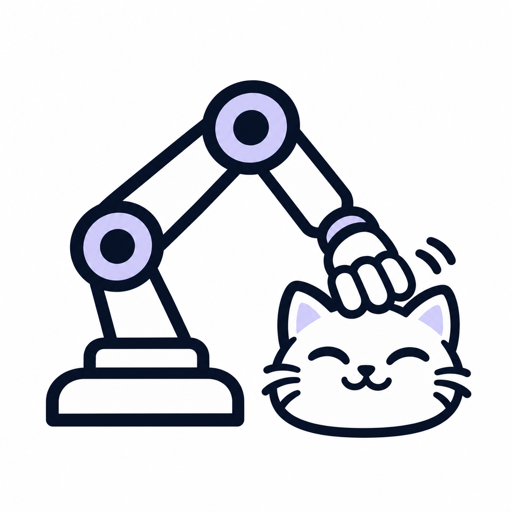
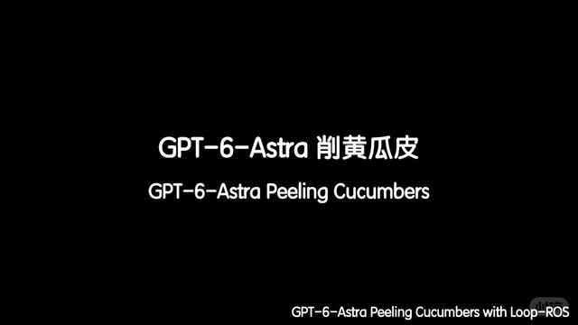
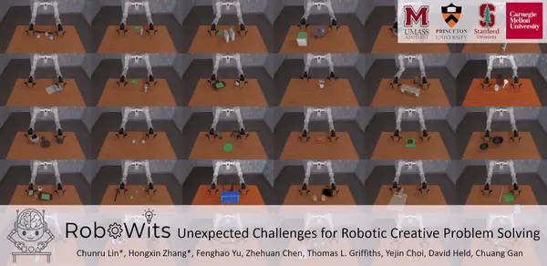
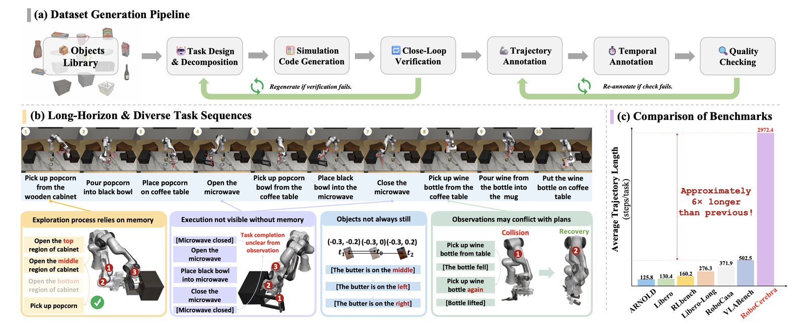
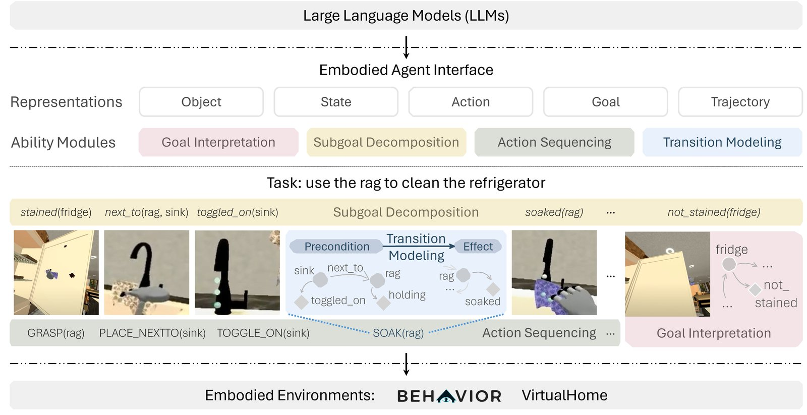
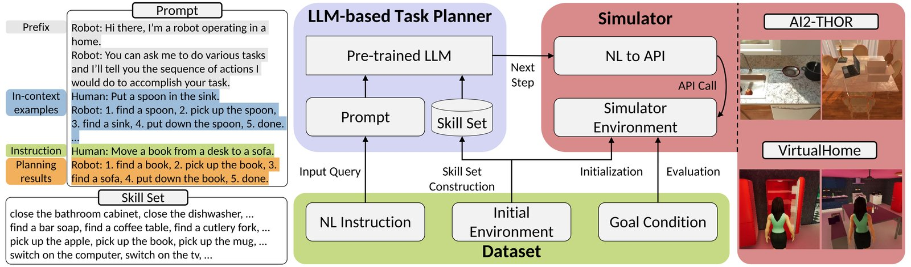
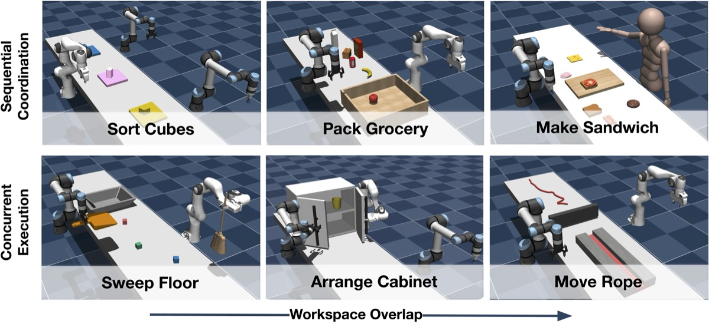

<div align="center">



# Awesome Robot Use Agent (RUA)

[](https://awesome.re) [](https://kairunwen.github.io/Awesome-Robot-Use-Agent/) [](#contents) [](#social-demos)
<br>
[](#tools--utilities) [](#-contributing) [](https://github.com/kairunwen/Awesome-Robot-Use-Agent) [](LICENSE)

[Articles](#articles) · [Papers](#papers) · [Projects](#projects) · [Benchmarks](#benchmarks-1) · [Social Demos](#social-demos)

</div>

> A **robot-use agent** is an AI system that **reasons** about user-specified goals, **plans** actions, and **acts** in the physical world by using robots as tools through available skills and perception/control interfaces. It uses observations and execution feedback to assess progress, adjust plans, and attempt recovery from failures.

A curated collection of articles, papers, open-source projects, community demos, and benchmarks for **robot-use agents**. Explore how AI agents connect to robots, use perception and control tools, generate executable code, and learn from execution feedback to carry out tasks in simulation and the **physical world**.

---

## Contents

- [Getting started](#getting-started)
- [Articles](#articles)
- [Papers](#papers)
  - [Surveys](#surveys)
  - [Methods & Frameworks](#methods--frameworks)
  - [Dataset Papers](#dataset-papers)
  - [Benchmarks](#benchmark-papers)
- [Projects](#projects)
  - [Open Source](#open-source)
    - [Systems & Frameworks](#systems--frameworks)
    - [Environment & Sandbox](#environment--sandbox)
    - [Tools & Utilities](#tools--utilities)
  - [Social Demos](#social-demos)
- [Datasets](#datasets)
- [Benchmarks](#benchmarks-1)

[🤝 Contributing](#-contributing) · [📖 Citation](#citation)

---

## Getting started

- **Understand:** Start with [Robot-Use Agents](https://web.mit.edu/phillipi/www/writing/robot-use-agents.html) and [Surveys](#surveys) for an overview.
- **Explore:** Discover approaches in [Methods & Frameworks](#methods--frameworks).
- **Build:** Find [Systems & Frameworks](#systems--frameworks), [Tools & Utilities](#tools--utilities), and [Environment & Sandbox](#environment--sandbox) for your project.
- **Evaluate:** Explore [Benchmarks](#benchmarks-1) for evaluating robot-use agents.
- **Watch:** Browse [Social Demos](#social-demos) from X / RedNote, better viewed on the [website](https://kairunwen.github.io/Awesome-Robot-Use-Agent/#social-demos).

---

## Articles

<a id="blogs-and-demos"></a>
<a id="blogs-and-perspectives"></a>

- **[Robot-Use Agents](https://web.mit.edu/phillipi/www/writing/robot-use-agents.html)** — Phillip Isola · 2026-09-07 · **Perspective**. General-purpose AI agents using robots through sensor and actuator APIs, with discussion of deployment, latency, and reliability. [Author post](https://x.com/phillip_isola/status/2097045136051933566); discusses agents including Claude.

- **[Claude plays robotics](https://www.anthropic.com/research/claude-plays-robotics)** — Anthropic · 2026-07-09 · **Research article**. Compares direct motor commands, generated controllers, pretrained-policy supervision, and RL training across control, locomotion, and manipulation tasks. Author-reported results show that robot embodiment and control interface strongly affect performance. Direct-control simulations pause between model calls; physical Go2 explorations should be distinguished from simulated benchmark results.

- **[Introducing Auto Engineering for Robotics](https://www.generalrobotics.company/post/introducing-auto-engineering-for-robotics)** — General Robotics · 2026-09-09 · **Research Blog**. Introduces GRID’s agent-driven workflow for robot integration, simulation, skill creation, and deployment evaluation. Demonstrates laboratory manipulation tasks and describes how execution feedback helps agents diagnose failures, repair components, and retain reusable skills and engineering knowledge.

- **[Introducing Waddle: agents that control robots](https://www.waddlelabs.ai/research/introducing-waddle)** — Waddle Labs · 2026-07 · **Research Blog**. Describes agents that observe camera feeds, generate robot-control programs, and call action models as tools. Presents real-robot demonstrations of task decomposition, outcome verification, replanning, and multi-agent coordination, with reusable skills shared across agents.

- **[NVIDIA brings agents to life with DGX Spark and Reachy Mini](https://huggingface.co/blog/nvidia-reachy-mini)** — Hugging Face & NVIDIA · 2026-01-05 · **Technical tutorial**. Connects Nemotron reasoning and vision models, NeMo Agent Toolkit, and Pipecat to Reachy Mini for voice, camera input, and robot behaviors. Describes ReAct tool calling and Python interfaces for hardware or simulation; focuses on a desktop interactive robot rather than general manipulation.

- **[Gemini Robotics ER 2](https://deepmind.google/models/gemini-robotics/embodied-reasoning/)** — Google DeepMind · **Model overview**. Describes embodied reasoning for multi-step planning, tool use, success tracking, and multi-robot coordination. ER 2 provides high-level decisions while a connected VLA handles motor execution; the page presents developer-reported capabilities and evaluations.

---

## Papers

Paper references are grouped by contribution. Dates refer to first arXiv release unless noted. Method summaries reflect author reports; code, weights, and complete reproduction are separate release claims. Cross-links connect papers with related implementations and benchmarks; the resource count reflects catalogue entries, including these separate listings.

<a id="research-papers"></a>

### Surveys

<table class="layout-paper">
<thead><tr><th width="42%">Work</th><th width="15%">Links</th><th width="43%">Summary</th></tr>
</thead>
<tbody>
<tr><td><strong>Survey on Multimodal Embodied Agents: A Unified Capability-centric Perspective from Computer-Use to Robot-Use</strong><br/><sub class="layout-meta">2026-09-10 · ArXiv 2026</sub></td><td><div class="layout-links"><a href="https://doi.org/10.6084/m9.figshare.33529048" title="Paper"></a> <a href="https://showlab.github.io/Awesome-Multimodal-Embodied-Agent/" title="Project"></a> <a href="https://github.com/showlab/Awesome-Multimodal-Embodied-Agent" title="Code — live GitHub stars for showlab/Awesome-Multimodal-Embodied-Agent (entire repository)"></a> </div></td><td><p class="layout-description">Unifies computer-use and robot-use through PAPAV: Perceive, Anticipate, Plan, Act, and Verify; examines physical constraints and benchmark coverage.</p></td></tr>
<tr><td><strong>A Survey on Agentic Multimodal Large Language Models</strong><br/><sub class="layout-meta">2025-10-13 · ArXiv 2025</sub></td><td><div class="layout-links"><a href="https://arxiv.org/abs/2510.10991" title="Paper"></a> <a href="https://github.com/HJYao00/Awesome-Agentic-MLLMs" title="Code — live GitHub stars for HJYao00/Awesome-Agentic-MLLMs (entire repository)"></a> </div></td><td><p class="layout-description">Broader multimodal-agent survey covering reasoning, reflection, memory, tool invocation, and interaction with physical environments, including embodied AI applications.</p></td></tr>
<tr><td><strong>Towards Embodied Agentic AI: Review and Classification of LLM- and VLM-Driven Robot Autonomy and Interaction</strong><br/><sub class="layout-meta">2025-08-07 · ArXiv 2025</sub></td><td><div class="layout-links"><a href="https://arxiv.org/abs/2508.05294" title="Paper"></a> </div></td><td><p class="layout-description">Classifies how LLM/VLM agents integrate with robot APIs, ROS middleware, and orchestration frameworks; covers planning, tool calling, agent roles, and practical robotics toolkits.</p></td></tr>
<tr><td><strong>A Survey on Integration of Large Language Models with Intelligent Robots</strong><br/><sub class="layout-meta">2024-04-14 · Intelligent Service Robotics 2024</sub></td><td><div class="layout-links"><a href="https://arxiv.org/abs/2404.09228" title="Paper"></a> </div></td><td><p class="layout-description">LLM integration across communication, perception, planning, and control.</p></td></tr>
</tbody>
</table>

<a id="models--frameworks"></a>

### Methods & Frameworks

<a id="embodied-harnesses-and-policy-orchestration"></a>
<a id="planning-and-code-as-policies"></a>
<a id="execution-feedback-and-recovery"></a>

<table class="layout-paper">
<thead><tr><th width="42%">Work</th><th width="15%">Links</th><th width="43%">Summary</th></tr>
</thead>
<tbody>
<tr><td><strong>Show-Harness: Just a VLM Agent Can Play Robots</strong><br/><sub class="layout-meta">2026-09-09 · ArXiv 2026</sub></td><td><div class="layout-links"><a href="https://arxiv.org/abs/2609.10522" title="Paper"></a> <a href="https://showlab.github.io/Show-Harness/" title="Project"></a> <a href="https://github.com/showlab/Show-Harness" title="Code — live GitHub stars for showlab/Show-Harness (entire repository)"></a> <a href="https://huggingface.co/datasets/showlab/Show-Harness-Data" title="Data"></a> <a href="https://huggingface.co/showlab/Show-Harness-VLMs" title="Models"></a> </div></td><td><p class="layout-description">VLMs select discrete, incremental action units grounded by robot-specific interpreters.</p><details class="entry-notes"><summary>Details &amp; sources</summary><div>Includes planning, action-history and recovery plugins, GUMI demonstration collection, and fine-tuning tools. Franka/Piper and simulator adapters require their documented dependencies and site configuration.</div></details></td></tr>
<tr><td><strong>Zetta ζ: An Efficient Closed-Loop Embodied Harness for Self-Evolving Physical Intelligence</strong><br/><sub class="layout-meta">2026-08-17 · ArXiv 2026</sub></td><td><div class="layout-links"><a href="https://arxiv.org/abs/2608.16590" title="Paper"></a> <a href="https://air-embodied-brain.github.io/zetta/" title="Project"></a> <a href="https://github.com/air-embodied-brain/Zetta-Embodiment" title="Code — live GitHub stars for air-embodied-brain/Zetta-Embodiment (entire repository)"></a> </div></td><td><p class="layout-description">Keeps the base policy frozen while developing runtime critics and recovery skills through execution, diagnosis, and gated updates.</p></td></tr>
<tr><td><strong>SHAPER: Self-Evolving Embodied Agents via Skill-Harness Evolution</strong><br/><sub class="layout-meta">2026-08-11 · ArXiv 2026</sub></td><td><div class="layout-links"><a href="https://arxiv.org/abs/2608.11350" title="Paper"></a> </div></td><td><p class="layout-description">Keeps model parameters frozen while evolving reusable skills and a context-code harness from target-environment rollouts.</p><details class="entry-notes"><summary>Details &amp; sources</summary><div>Evaluated on VLABench and ESI-Bench with different action interfaces. Improves external skills and execution context without model training.</div></details></td></tr>
<tr><td><strong>Mimir: A Neuro-Symbolic Memory System with Dynamic Grounding for Embodied Agents in Interactive Environments</strong><br/><sub class="layout-meta">2026-08-05 · ArXiv 2026</sub></td><td><div class="layout-links"><a href="https://arxiv.org/abs/2608.04933" title="Paper"></a> </div></td><td><p class="layout-description">Separates world memory from task memory and grounds the active goal in recalled objects, state, and evidence before each action.</p><details class="entry-notes"><summary>Details &amp; sources</summary><div>Memory module evaluated in simulation on EB-ALFRED and EB-Habitat.</div></details></td></tr>
<tr><td><strong>ETA: A New Agentic Paradigm for Embodied Tasks</strong><br/><sub class="layout-meta">2026-08-04 · ArXiv 2026</sub></td><td><div class="layout-links"><a href="https://arxiv.org/abs/2608.03924" title="Paper"></a> <a href="https://openmoss.ai/OpenETA/" title="Project"></a> <a href="https://github.com/OpenMOSS/OpenETA" title="Code — live GitHub stars for OpenMOSS/OpenETA (entire repository)"></a> </div></td><td><p class="layout-description">A planner selects one tool call at a time, executes it through a common interface, and uses fresh observations and results to revise plans and retain experience.</p><details class="entry-notes"><summary>Details &amp; sources</summary><div>OpenETA provides replaceable planners, tools and skills, memory, replayable trajectories, and simulation/real-robot interfaces. Hardware execution requires the corresponding adapter and setup.</div></details></td></tr>
<tr><td><strong>Thea — Towards the Harness of Embodied Agents</strong><br/><sub class="layout-meta">2026-08-03 · ArXiv 2026</sub></td><td><div class="layout-links"><a href="https://arxiv.org/abs/2608.11246" title="Paper"></a> <a href="https://eit-hai.github.io/thea/" title="Project"></a> <a href="https://github.com/EIT-HAI/Thea" title="Code — live GitHub stars for EIT-HAI/Thea (entire repository)"></a> </div></td><td><p class="layout-description">Wraps robot capabilities as callable tools, maintains symbolic scene context, and evaluates action termination, success, and failure causes.</p><details class="entry-notes"><summary>Details &amp; sources</summary><div>Public runtime and interfaces; robot/simulator deployment requires concrete adapters and capabilities.</div></details></td></tr>
<tr><td><strong>You Don't Need To Stay in The Loop: An Agentic Robotics Loop for Robot-Policy Improvement (AgenticRobotics)</strong><br/><sub class="layout-meta">2026-08-02 · ArXiv 2026</sub></td><td><div class="layout-links"><a href="https://arxiv.org/abs/2608.07555" title="Paper"></a> </div></td><td><p class="layout-description">An LLM controller coordinates training, evaluation, and policy-improvement workers with recorded tool calls, evidence-gated promotion, and recoverable execution state.</p><details class="entry-notes"><summary>Details &amp; sources</summary><div>Preview report focused on false-promotion control and operational reliability; it does not demonstrate better checkpoint selection than a human on the measured lineage.</div></details></td></tr>
<tr><td><strong>Addressing the Orchestration Gap in Generalist Robots via Physical Agency</strong><br/><sub class="layout-meta">2026-07-23 · ArXiv 2026</sub></td><td><div class="layout-links"><a href="https://arxiv.org/abs/2607.21725" title="Paper"></a> <a href="https://lianegalanti.github.io/Pigey/" title="Project"></a> <a href="https://github.com/lianegalanti/Pigey" title="Code — live GitHub stars for lianegalanti/Pigey (entire repository)"></a> </div></td><td><p class="layout-description">A closed-loop orchestrator decomposes goals, selects frozen VLA policies or parameterized skills, verifies outcomes from observations, and recovers from failures.</p><details class="entry-notes"><summary>Details &amp; sources</summary><div>Evaluated on LIBERO-PRO and real-robot manipulation without additional policy training. Includes simulation and Franka FR3 orchestrators; execution requires separately configured perception, planning, policy servers, and robot interfaces.</div></details></td></tr>
<tr><td><strong>RoboHarness: Memory-Driven Orchestration of Heterogeneous Robot Policies for Long-Horizon Planning</strong><br/><sub class="layout-meta">2026-07-20 · ArXiv 2026</sub></td><td><div class="layout-links"><a href="https://arxiv.org/abs/2607.18060" title="Paper"></a> <a href="https://www.robo-harness.com/" title="Project"></a> </div></td><td><p class="layout-description">Uses execution memory to route among heterogeneous policies and a Memory Bridge to improve handoffs between policies.</p></td></tr>
<tr><td><strong>PhyAgentOS: A Self-Evolving Operating System for Embodied Agents with Decoupled Cognitive Planning and Physical Execution</strong><br/><sub class="layout-meta">2026-07-18 · ArXiv 2026</sub></td><td><div class="layout-links"><a href="https://arxiv.org/abs/2607.16636" title="Paper"></a> <a href="https://phy-agent-os.net" title="Project"></a> <a href="https://github.com/PhyAgentOS/PhyAgentOS-core" title="Code — live GitHub stars for PhyAgentOS/PhyAgentOS-core (entire repository)"></a> </div></td><td><p class="layout-description">Separates cognitive planning from physical execution through session state, explicit task verification, and reusable experience.</p><details class="entry-notes"><summary>Details &amp; sources</summary><div>The paper describes file-based state views and a SessionVerifier that distinguishes execution termination from task success. The evolving runtime requires separately configured tools and robot or simulator adapters.</div></details></td></tr>
<tr><td><strong>RoboTTT: Context Scaling for Robot Policies</strong><br/><sub class="layout-meta">2026-07-16 · ArXiv 2026</sub></td><td><div class="layout-links"><a href="https://arxiv.org/abs/2607.15275" title="Paper"></a> <a href="https://research.nvidia.com/labs/gear/robottt/" title="Project"></a> </div></td><td><p class="layout-description">Uses test-time training fast weights to condition robot policies on long visuomotor histories, supporting adaptation from demonstrations and execution context.</p><details class="entry-notes"><summary>Details &amp; sources</summary><div>Policy-learning research evaluated on real-robot manipulation tasks.</div></details></td></tr>
<tr><td><strong>Harness VLA: Steering Frozen VLAs into Reliable Manipulation Primitives via Memory-Guided Agents</strong><br/><sub class="layout-meta">2026-07-09 · ArXiv 2026</sub></td><td><div class="layout-links"><a href="https://arxiv.org/abs/2607.08448" title="Paper"></a> <a href="https://harnessvla.github.io/" title="Project"></a> <a href="https://github.com/RLinf/RPent" title="Code — live GitHub stars for RLinf/RPent (entire repository)"></a> </div></td><td><p class="layout-description">Exposes a frozen VLA as a retryable contact-rich primitive, coordinated with fixed analytic primitives and memory of execution outcomes.</p><details class="entry-notes"><summary>Details &amp; sources</summary><div>Evaluated on LIBERO-Pro, RoboCasa365, and RoboTwin C2R without VLA fine-tuning. The paper links to RPent, which provides the runtime and simulator/VLA integrations; deployment requires the relevant models and environment setup.</div></details></td></tr>
<tr><td><strong>GaP: A Graph-as-Policy Multi-Agent Self-Learning Harness For Variational Automation Tasks</strong><br/><sub class="layout-meta">2026-07-06 · ArXiv 2026</sub></td><td><div class="layout-links"><a href="https://arxiv.org/abs/2607.05369" title="Paper"></a> <a href="https://graph-robots.github.io/gap/" title="Project"></a> <a href="https://github.com/graph-robots/graph-as-policy" title="Code — live GitHub stars for graph-robots/graph-as-policy (entire repository)"></a> </div></td><td><p class="layout-description">Compiles language instructions into executable graphs of modular robot skills, then uses simulation feedback to localize failures and refine the graph.</p><details class="entry-notes"><summary>Details &amp; sources</summary><div>Targets repeated task instances with varying object geometry and poses in a known workcell. Beta code includes graph generation, execution, and robot examples; deployment requires skill dependencies, calibrated sensors, and robot-specific connections.</div></details></td></tr>
<tr><td><strong>ASPIRE: Agentic /Skills Discovery for Robotics</strong><br/><sub class="layout-meta">2026-06-30 · ArXiv 2026 · ⭐</sub></td><td><div class="layout-links"><a href="https://arxiv.org/abs/2607.00272" title="Paper"></a> <a href="https://research.nvidia.com/labs/gear/aspire/" title="Project"></a> <a href="https://github.com/NVlabs/ASPIRE" title="Code — live GitHub stars for NVlabs/ASPIRE (entire repository)"></a> </div></td><td><p class="layout-description">Refines code-as-policy programs using multimodal execution traces, failure diagnosis, repair validation, a reusable skill library, and evolutionary search.</p><details class="entry-notes"><summary>Details &amp; sources</summary><div>Provides simulation workflows and real-robot transfer code. Behaviors remain bounded by predefined perception, planning, and control primitives; real-world deployment requires success detection, resets, safety monitoring, and calibration.</div></details></td></tr>
<tr><td><strong>ENPIRE: Agentic Robot Policy Self-Improvement in the Real World</strong><br/><sub class="layout-meta">2026-06-18 · ArXiv 2026 · ⭐</sub></td><td><div class="layout-links"><a href="https://arxiv.org/abs/2606.19980" title="Paper"></a> <a href="https://research.nvidia.com/labs/gear/enpire/" title="Project"></a> <a href="https://github.com/NVlabs/ENPIRE" title="Code — live GitHub stars for NVlabs/ENPIRE (entire repository)"></a> </div></td><td><p class="layout-description">Connects scene reset, policy execution, outcome verification, and experiment refinement so coding agents can improve policies through physical trials.</p><details class="entry-notes"><summary>Details &amp; sources</summary><div>Deployment requires calibrated stations and task-specific reset and verification functions.</div></details></td></tr>
<tr><td><strong>Playful Agentic Robot Learning</strong><br/><sub class="layout-meta">2026-06-17 · ArXiv 2026</sub></td><td><div class="layout-links"><a href="https://arxiv.org/abs/2606.19419" title="Paper"></a> <a href="https://playful-rats.github.io/" title="Project"></a> <a href="https://github.com/Playful-RATs/RATs" title="Code — live GitHub stars for Playful-RATs/RATs (entire repository)"></a> </div></td><td><p class="layout-description">Proposes its own practice tasks, writes and executes robot code, diagnoses failures, and distills successful behavior into reusable skills before downstream tasks arrive.</p><details class="entry-notes"><summary>Details &amp; sources</summary><div>Evaluates a frozen skill library on held-out LIBERO-PRO and MolmoSpaces tasks, with transfer to RoboSuite and real robots without model fine-tuning. The repository includes play/evaluation workflows and skill libraries; execution requires the documented simulator or hardware setup.</div></details></td></tr>
<tr><td><strong>Guava: An Effective and Universal Harness for Embodied Manipulation</strong><br/><sub class="layout-meta">2026-06-16 · ArXiv 2026</sub></td><td><div class="layout-links"><a href="https://arxiv.org/abs/2606.18363" title="Paper"></a> <a href="https://guava-harness.github.io/" title="Project"></a> </div></td><td><p class="layout-description">Studies iterative perception–reasoning–action, semantic action abstractions, and multimodal observations; also describes distillation into a smaller agent model.</p></td></tr>
<tr><td><strong>What Matters in Orchestrating Robot Policies: A Systematic Study of Hierarchical VLA Agents</strong><br/><sub class="layout-meta">2026-06-09 · ArXiv 2026</sub></td><td><div class="layout-links"><a href="https://arxiv.org/abs/2606.10267" title="Paper"></a> <a href="https://jiahenghu.github.io/hi-vla/" title="Project"></a> </div></td><td><p class="layout-description">Studies high-level VLM planners and low-level VLA controllers, including subgoal switching, observation representation, and planner memory.</p><details class="entry-notes"><summary>Details &amp; sources</summary><div>Compares hierarchy design choices in simulation and on an ALOHA robot. This is a study of policy orchestration.</div></details></td></tr>
<tr><td><strong>Enabling Extensible Embodied Capabilities with Tools</strong><br/><sub class="layout-meta">2026-05-26 · ArXiv 2026</sub></td><td><div class="layout-links"><a href="https://arxiv.org/abs/2605.26637" title="Paper"></a> <a href="https://racingemperor.github.io/manip-tool-hub/" title="Project"></a></div></td><td><p class="layout-description">Externalizes embodied capabilities as callable tools through the Embodied Tool Protocol (ETP), with EmbodiedToolBench evaluating tool-need recognition, selection, execution, and composition.</p><details class="entry-notes"><summary>Details &amp; sources</summary><div>Describes 100+ validated tools spanning perception, cognition, reasoning, and execution, evaluated in simulation and on real robots. Reported benefits are stronger for perception and cognition than fine-grained execution.</div></details></td></tr>
<tr><td><strong>EmbodiSkill: Skill-Aware Reflection for Self-Evolving Embodied Agents</strong><br/><sub class="layout-meta">2026-05-11 · ArXiv 2026</sub></td><td><div class="layout-links"><a href="https://arxiv.org/abs/2605.10332" title="Paper"></a> <a href="https://air-embodied-brain.github.io/EmbodiSkill/" title="Project"></a> <a href="https://github.com/air-embodied-brain/EmbodiSkill" title="Code — live GitHub stars for air-embodied-brain/EmbodiSkill (entire repository)"></a> </div></td><td><p class="layout-description">Reflects on execution trajectories to distinguish defective skills from execution lapses, then revises skill content or reinforces valid guidance.</p><details class="entry-notes"><summary>Details &amp; sources</summary><div>Training-free skill evolution with a frozen executor, evaluated on ALFWorld and EmbodiedBench. The released implementation targets these simulated environments.</div></details></td></tr>
<tr><td><strong>Learning while Deploying: Fleet-Scale Reinforcement Learning for Generalist Robot Policies (LWD)</strong><br/><sub class="layout-meta">2026-05-01 · ArXiv 2026</sub></td><td><div class="layout-links"><a href="https://arxiv.org/abs/2605.00416" title="Paper"></a> <a href="https://finch.agibot.com/research/lwd" title="Project"></a> </div></td><td><p class="layout-description">Improves generalist robot policies using fleet-scale deployment experience, offline–online reinforcement learning, and human interventions.</p><details class="entry-notes"><summary>Details &amp; sources</summary><div>Supporting policy-learning research evaluated with 16 dual-arm robots across eight tasks. Human interventions remain part of the learning workflow.</div></details></td></tr>
<tr><td><strong>Robot Planning and Situation Handling with Active Perception</strong><br/><sub class="layout-meta">2026-04-28 · IROS 2026</sub></td><td><div class="layout-links"><a href="https://arxiv.org/abs/2604.26988" title="Paper"></a> <a href="https://vap-tamp.github.io/vap-tamp/" title="Project"></a> </div></td><td><p class="layout-description">VAP-TAMP combines VLM-guided active view selection and situation assessment with scene graphs and task-and-motion planning to handle execution-time disruptions.</p><details class="entry-notes"><summary>Details &amp; sources</summary><div>Evaluated on service tasks in simulation and on a mobile manipulation platform.</div></details></td></tr>
<tr><td><strong>RoboClaw: An Agentic Framework for Scalable Long-Horizon Robotic Tasks</strong><br/><sub class="layout-meta">2026-03-12 · ArXiv 2026</sub></td><td><div class="layout-links"><a href="https://arxiv.org/abs/2603.11558" title="Paper"></a> <a href="https://roboclaw-agibot.github.io/" title="Project"></a> <a href="https://github.com/RoboClaw-Robotics/RoboClaw" title="Code — live GitHub stars for RoboClaw-Robotics/RoboClaw (entire repository)"></a> </div></td><td><p class="layout-description">A VLM controller coordinates data collection, policy learning, and long-horizon execution; forward and inverse action pairs enable self-resetting collection.</p><details class="entry-notes"><summary>Details &amp; sources</summary><div>Real-robot manipulation evaluations connect learned policy primitives with high-level planning and recovery. Hardware, policies, and reset behaviors require the corresponding setup.</div></details></td></tr>
<tr><td><strong>Agentic Self-Evolutionary Replanning for Embodied Navigation (SERP)</strong><br/><sub class="layout-meta">2026-03-03 · ArXiv 2026</sub></td><td><div class="layout-links"><a href="https://arxiv.org/abs/2603.02772" title="Paper"></a> </div></td><td><p class="layout-description">Combines online action-model adaptation with LLM-guided graph-based replanning to respond to navigation failures and changing conditions.</p><details class="entry-notes"><summary>Details &amp; sources</summary><div>Evaluated in simulation and real navigation environments. Adaptation uses in-context learning and automatic differentiation.</div></details></td></tr>
<tr><td><strong>VLAW: Iterative Co-Improvement of Vision-Language-Action Policy and World Model</strong><br/><sub class="layout-meta">2026-02-12 · ArXiv 2026</sub></td><td><div class="layout-links"><a href="https://arxiv.org/abs/2602.12063" title="Paper"></a> <a href="https://sites.google.com/view/vla-w" title="Project"></a> <a href="https://github.com/Robert-gyj/Ctrl-World" title="Code — live GitHub stars for Robert-gyj/Ctrl-World (entire repository)"></a> </div></td><td><p class="layout-description">Uses real rollouts to improve an action-conditioned world model, then synthetic rollouts to improve the VLA policy in an iterative loop.</p><details class="entry-notes"><summary>Details &amp; sources</summary><div>Supporting policy-learning research with real-robot evaluation. The released Ctrl-World code covers the world-model post-training component of VLAW.</div></details></td></tr>
<tr><td><strong>Self-Improving Embodied Foundation Models</strong><br/><sub class="layout-meta">2025-09-18 · NeurIPS 2025</sub></td><td><div class="layout-links"><a href="https://arxiv.org/abs/2509.15155" title="Paper"></a> <a href="https://self-improving-efms.github.io/" title="Project"></a> </div></td><td><p class="layout-description">Combines demonstration learning, learned success and progress estimates, and autonomous reinforcement-learning practice to improve robot policies.</p><details class="entry-notes"><summary>Details &amp; sources</summary><div>Policy training and reward-learning research evaluated in simulation and on real robots.</div></details></td></tr>
<tr><td><strong>Hi Robot: Open-Ended Instruction Following with Hierarchical Vision-Language-Action Models</strong><br/><sub class="layout-meta">2025-02-26 · ICML 2025</sub></td><td><div class="layout-links"><a href="https://arxiv.org/abs/2502.19417" title="Paper"></a> <a href="https://www.physicalintelligence.company/research/hirobot" title="Project"></a> </div></td><td><p class="layout-description">A high-level VLM interprets complex instructions and situated user feedback, while a low-level VLA executes the selected subtask.</p><details class="entry-notes"><summary>Details &amp; sources</summary><div>Demonstrated on single-arm, dual-arm, and mobile dual-arm platforms.</div></details></td></tr>
<tr><td><strong>Code-as-Monitor: Constraint-aware Visual Programming for Reactive and Proactive Robotic Failure Detection</strong><br/><sub class="layout-meta">2024-12-05 · CVPR 2025</sub></td><td><div class="layout-links"><a href="https://arxiv.org/abs/2412.04455" title="Paper"></a> <a href="https://zhoues.github.io/Code-as-Monitor/" title="Project"></a> </div></td><td><p class="layout-description">Generates visual monitoring code to evaluate spatio-temporal constraints, detecting failures after they occur and anticipating constraint violations.</p><details class="entry-notes"><summary>Details &amp; sources</summary><div>Execution-monitoring module that can close the loop around an existing policy; evaluated in simulation and a real-world setting.</div></details></td></tr>
<tr><td><strong>EMOS: Embodiment-aware Heterogeneous Multi-robot Operating System with LLM Agents</strong><br/><sub class="layout-meta">2024-10-30 · ICLR 2025</sub></td><td><div class="layout-links"><a href="https://arxiv.org/abs/2410.22662" title="Paper"></a> <a href="https://emos-project.github.io/" title="Project"></a> <a href="https://github.com/SgtVincent/EMOS" title="Code — live GitHub stars for SgtVincent/EMOS (entire repository)"></a> </div></td><td><p class="layout-description">LLM agents read URDF descriptions and call kinematics tools to build robot capability profiles, then coordinate heterogeneous robots for planning and execution.</p><details class="entry-notes"><summary>Details &amp; sources</summary><div>Includes Habitat-MAS for embodiment-aware multi-robot reasoning. Evaluations use simulated manipulation, perception, navigation, and rearrangement tasks.</div></details></td></tr>
<tr><td><strong>AHA: A Vision-Language-Model for Detecting and Reasoning Over Failures in Robotic Manipulation</strong><br/><sub class="layout-meta">2024-10-01 · ICLR 2025</sub></td><td><div class="layout-links"><a href="https://arxiv.org/abs/2410.00371" title="Paper"></a> <a href="https://aha-vlm.github.io/" title="Project"></a> <a href="https://github.com/NVlabs/AHA" title="Code — live GitHub stars for NVlabs/AHA (entire repository)"></a> </div></td><td><p class="layout-description">Produces natural-language failure diagnoses that can refine rewards, task plans, and subtask verification in robot manipulation systems.</p><details class="entry-notes"><summary>Details &amp; sources</summary><div>Failure-reasoning component using FailGen-generated simulation failure data, with integrations into three manipulation frameworks.</div></details></td></tr>
<tr><td><strong>ReKep: Spatio-Temporal Reasoning of Relational Keypoint Constraints for Robotic Manipulation</strong><br/><sub class="layout-meta">2024-09-03 · CoRL 2024</sub></td><td><div class="layout-links"><a href="https://arxiv.org/abs/2409.01652" title="Paper"></a> <a href="https://rekep-robot.github.io/" title="Project"></a> <a href="https://github.com/huangwl18/ReKep" title="Code — live GitHub stars for huangwl18/ReKep (entire repository)"></a> </div></td><td><p class="layout-description">Converts language instructions and RGB-D observations into Python functions over 3D keypoints; hierarchical optimization solves end-effector actions in a perception-action loop.</p><details class="entry-notes"><summary>Details &amp; sources</summary><div>The paper demonstrates mobile single-arm and stationary dual-arm systems. The released code includes constraint generation and simulation execution; hardware use requires its own integration.</div></details></td></tr>
<tr><td><strong>VoxPoser: Composable 3D Value Maps for Robotic Manipulation with Language Models</strong><br/><sub class="layout-meta">2023-07-12 · CoRL 2023</sub></td><td><div class="layout-links"><a href="https://arxiv.org/abs/2307.05973" title="Paper"></a> <a href="https://voxposer.github.io/" title="Project"></a> <a href="https://github.com/huangwl18/VoxPoser" title="Code — live GitHub stars for huangwl18/VoxPoser (entire repository)"></a> </div></td><td><p class="layout-description">Uses generated code and visual grounding to construct 3D value maps for motion planning; the generated program can be reevaluated with visual feedback.</p><details class="entry-notes"><summary>Details &amp; sources</summary><div>The public repository provides an RLBench demo; it excludes the full perception pipeline used in real-robot experiments.</div></details></td></tr>
<tr><td><strong>SayPlan: Grounding Large Language Models using 3D Scene Graphs for Scalable Robot Task Planning</strong><br/><sub class="layout-meta">2023-07-12 · CoRL 2023</sub></td><td><div class="layout-links"><a href="https://arxiv.org/abs/2307.06135" title="Paper"></a> <a href="https://sayplan.github.io/" title="Project"></a> </div></td><td><p class="layout-description">Searches hierarchical 3D scene graphs, calls a classical path planner, and uses scene-graph simulator feedback to repair infeasible long-horizon plans.</p><details class="entry-notes"><summary>Details &amp; sources</summary><div>Targets large-scale mobile manipulation; the project includes real-robot demonstrations. Simulator feedback validates plans, not every aspect of physical execution.</div></details></td></tr>
<tr><td><strong>RoCo: Dialectic Multi-Robot Collaboration with Large Language Models</strong><br/><sub class="layout-meta">2023-07-10 · ICRA 2024</sub></td><td><div class="layout-links"><a href="https://arxiv.org/abs/2307.04738" title="Paper"></a> <a href="https://project-roco.github.io/" title="Project"></a> <a href="https://github.com/MandiZhao/robot-collab" title="Code — live GitHub stars for MandiZhao/robot-collab (entire repository)"></a> </div></td><td><p class="layout-description">Robot agents negotiate subtasks through dialogue and generate task-space waypoints, revising plans using collision checks and other environment feedback.</p><details class="entry-notes"><summary>Details &amp; sources</summary><div>Includes the six-task RoCoBench simulation benchmark and real-world human-robot collaboration demonstrations. Motion planning is provided by a separate planner.</div></details></td></tr>
<tr><td><strong>Robots That Ask For Help: Uncertainty Alignment for Large Language Model Planners</strong><br/><sub class="layout-meta">2023-07-04 · CoRL 2023</sub></td><td><div class="layout-links"><a href="https://arxiv.org/abs/2307.01928" title="Paper"></a> <a href="https://robot-help.github.io/" title="Project"></a> <a href="https://github.com/google-research/google-research/tree/master/language_model_uncertainty" title="Code — live GitHub stars for google-research/google-research (entire repository)"></a> </div></td><td><p class="layout-description">KnowNo uses conformal prediction to calibrate a language-model planner’s uncertainty and request human clarification when action choices remain ambiguous.</p><details class="entry-notes"><summary>Details &amp; sources</summary><div>Evaluated in simulated and real-robot tasks. Statistical guarantees depend on the calibration assumptions; the method does not by itself verify physical execution safety.</div></details></td></tr>
<tr><td><strong>DoReMi: Grounding Language Model by Detecting and Recovering from Plan-Execution Misalignment</strong><br/><sub class="layout-meta">2023-07-01 · IROS 2024</sub></td><td><div class="layout-links"><a href="https://arxiv.org/abs/2307.00329" title="Paper"></a> <a href="https://sites.google.com/view/doremi-paper" title="Project"></a> </div></td><td><p class="layout-description">An LLM generates task plans and execution constraints, while a VLM continuously checks violations to trigger recovery when execution diverges from the plan.</p><details class="entry-notes"><summary>Details &amp; sources</summary><div>Studies robot-arm and humanoid tasks with disturbances or imperfect controllers.</div></details></td></tr>
<tr><td><strong>REFLECT: Summarizing Robot Experiences for Failure Explanation and Correction</strong><br/><sub class="layout-meta">2023-06-27 · CoRL 2023</sub></td><td><div class="layout-links"><a href="https://arxiv.org/abs/2306.15724" title="Paper"></a> <a href="https://robot-reflect.github.io/" title="Project"></a> <a href="https://github.com/real-stanford/reflect" title="Code — live GitHub stars for real-stanford/reflect (entire repository)"></a> </div></td><td><p class="layout-description">Summarizes multisensory execution history, explains failures, and conditions a planner on those explanations to produce corrective actions.</p></td></tr>
<tr><td><strong>RoboCat: A Self-Improving Generalist Agent for Robotic Manipulation</strong><br/><sub class="layout-meta">2023-06-20 · Transactions on Machine Learning Research (TMLR) 2023</sub></td><td><div class="layout-links"><a href="https://arxiv.org/abs/2306.11706" title="Paper"></a> <a href="https://deepmind.google/blog/robocat-a-self-improving-robotic-agent/" title="Project"></a> </div></td><td><p class="layout-description">Trains a visual goal-conditioned generalist policy across robot embodiments and incorporates self-generated experience into subsequent training.</p><details class="entry-notes"><summary>Details &amp; sources</summary><div>Policy-learning research in which self-improvement uses data collection and retraining.</div></details></td></tr>
<tr><td><strong>ProgPrompt: Generating Situated Robot Task Plans Using Large Language Models</strong><br/><sub class="layout-meta">2022-09-22 · ICRA 2023</sub></td><td><div class="layout-links"><a href="https://arxiv.org/abs/2209.11302" title="Paper"></a> <a href="https://progprompt.github.io/" title="Project"></a> <a href="https://github.com/NVlabs/progprompt-vh" title="Code — live GitHub stars for NVlabs/progprompt-vh (entire repository)"></a> </div></td><td><p class="layout-description">Prompts an LLM with available actions, scene objects, and example programs to generate executable task plans grounded in robot capabilities and context.</p><details class="entry-notes"><summary>Details &amp; sources</summary><div>The released implementation targets VirtualHome; the paper also reports physical tabletop robot experiments.</div></details></td></tr>
<tr><td><strong>Code as Policies: Language Model Programs for Embodied Control</strong><br/><sub class="layout-meta">2022-09-16 · ICRA 2023</sub></td><td><div class="layout-links"><a href="https://arxiv.org/abs/2209.07753" title="Paper"></a> <a href="https://code-as-policies.github.io/" title="Project"></a> <a href="https://github.com/google-research/google-research/tree/master/code_as_policies" title="Code — live GitHub stars for google-research/google-research (entire repository)"></a> <a href="https://research.google/blog/robots-that-write-their-own-code/" title="Blog"></a> </div></td><td><p class="layout-description">Generates programs that compose perception outputs, control APIs, and feedback loops.</p></td></tr>
<tr><td><strong>Inner Monologue: Embodied Reasoning through Planning with Language Models</strong><br/><sub class="layout-meta">2022-07-12 · CoRL 2022</sub></td><td><div class="layout-links"><a href="https://arxiv.org/abs/2207.05608" title="Paper"></a> <a href="https://innermonologue.github.io/" title="Project"></a> </div></td><td><p class="layout-description">Feeds success detection, scene descriptions, and human feedback into language-based planning; demonstrates replanning and responses to changed goals.</p></td></tr>
<tr><td><strong>SayCan — Do As I Can, Not As I Say: Grounding Language in Robotic Affordances</strong><br/><sub class="layout-meta">2022-04-04 · CoRL 2022</sub></td><td><div class="layout-links"><a href="https://arxiv.org/abs/2204.01691" title="Paper"></a> <a href="https://say-can.github.io/" title="Project"></a> <a href="https://github.com/google-research/google-research/tree/master/saycan" title="Code — live GitHub stars for google-research/google-research (entire repository)"></a> </div></td><td><p class="layout-description">Combines language-model skill scoring with affordance/value estimates to select feasible robot behaviors.</p></td></tr>
</tbody>
</table>

### Dataset Papers

Data for agent action selection, tool use, planning, and execution feedback, with broader robot demonstrations included as supporting resources. Dates follow the associated paper or linked announcement; public downloads, paper-described training data, data directories, and surveys are distinguished below.

<table class="layout-paper">
<thead><tr><th width="42%">Work</th><th width="15%">Links</th><th width="43%">Summary</th></tr>
</thead>
<tbody>
<tr><td><strong>RoboCerebra: A Large-scale Benchmark for Long-horizon Robotic Manipulation Evaluation</strong><br/><sub class="layout-meta">2025-06-07 · NeurIPS 2025</sub></td><td><div class="layout-links"><a href="https://arxiv.org/abs/2506.06677" title="Paper"></a> <a href="https://robocerebra.github.io/" title="Project"></a> <a href="https://github.com/qiuboxiang/RoboCerebra" title="Code"></a> <a href="https://huggingface.co/datasets/qiukingballball/RoboCerebra" title="Dataset"></a> </div></td><td><p class="layout-description">Long-horizon simulation demonstrations with subtask annotations, disturbances, and memory-dependent tasks.</p><details class="entry-notes"><summary>Details &amp; sources</summary><div>Supports hierarchical planning and execution evaluation; not a dedicated tool-call trace dataset.</div></details></td></tr>
</tbody>
</table>

<a id="benchmark-papers"></a>

### Benchmarks

This section focuses on benchmark papers and their research contributions; the [Benchmarks section below](#benchmarks-1) compares environments, tasks, and evaluation focus to help you choose a benchmark.

<table class="layout-paper">
<thead><tr><th width="42%">Work</th><th width="15%">Links</th><th width="43%">Summary</th></tr>
</thead>
<tbody>
<tr><td><strong>CaP-X: A Framework for Benchmarking and Improving Coding Agents for Robot Manipulation</strong><br/><sub class="layout-meta">2026-03-23 · ICML 2026 · ⭐</sub></td><td><div class="layout-links"><a href="https://arxiv.org/abs/2603.22435" title="Paper"></a> <a href="https://capgym.github.io/" title="Project"></a> <a href="https://github.com/capgym/cap-x" title="Code — live GitHub stars for capgym/cap-x (entire repository)"></a> </div></td><td><p class="layout-description">Studies embodied coding agents through CaP-Gym, CaP-Bench, CaP-Agent0, and CaP-RL, including execution feedback and skill synthesis.</p></td></tr>
<tr><td><strong>EmbodiedBench: Comprehensive Benchmarking Multi-modal Large Language Models for Vision-Driven Embodied Agents</strong><br/><sub class="layout-meta">2025-02-13 · ICML 2025</sub></td><td><div class="layout-links"><a href="https://arxiv.org/abs/2502.09560" title="Paper"></a> <a href="https://embodiedbench.github.io/" title="Project"></a> <a href="https://github.com/EmbodiedBench/EmbodiedBench" title="Code — live GitHub stars for EmbodiedBench/EmbodiedBench (entire repository)"></a> <a href="https://huggingface.co/EmbodiedBench" title="Data"></a> <a href="#benchmarks-1" title="benchmark catalogue"></a> </div></td><td><p class="layout-description">Vision-driven embodied-agent evaluation; see the benchmark catalogue .</p></td></tr>
<tr><td><strong>Embodied Agent Interface: Benchmarking LLMs for Embodied Decision Making</strong><br/><sub class="layout-meta">2024-10-09 · NeurIPS D&B 2024</sub></td><td><div class="layout-links"><a href="https://arxiv.org/abs/2410.07166" title="Paper"></a> <a href="https://embodied-agent-interface.github.io/" title="Project"></a> <a href="https://github.com/embodied-agent-interface/embodied-agent-interface" title="Code — live GitHub stars for embodied-agent-interface/embodied-agent-interface (entire repository)"></a> <a href="https://huggingface.co/datasets/Inevitablevalor/EmbodiedAgentInterface" title="Data"></a> <a href="#benchmarks-1" title="benchmark catalogue"></a> </div></td><td><p class="layout-description">Evaluation of embodied decision-making modules; see the benchmark catalogue .</p></td></tr>
</tbody>
</table>

---

## Projects

### Open Source

Code links and usage restrictions are recorded per entry. Research papers and their code links are listed together in [Papers](#papers); this section focuses on standalone tools, frameworks, environments, and demos. Check each repository, model, and dataset license before reuse.

<details class="project-group">
<summary><h4>Systems &amp; Frameworks</h4></summary>

<a id="agents-and-frameworks"></a>

<a id="agent-runtimes-and-orchestration"></a>

| Resource | Role | Interface | Deployment & evidence | Official source |
| --- | --- | --- | --- | --- |
| **AgenticROS** | ROS 2 capability and mission runtime | Named skills via MCP and agent adapters | <details class="entry-notes"><summary>Feedback, setup & limits</summary><p><strong>Feedback / workflow:</strong> Mission graphs pass step outputs and support failure branches.</p><p><strong>Setup:</strong> ROS 2 capabilities and mission definitions.</p><p><strong>Limits:</strong> The built-in natural-language mission compiler is rule-based, not an LLM planner.</p></details> | [Code](https://github.com/agenticros/agenticros) · [Docs](https://github.com/agenticros/agenticros#architecture) <br> [](https://github.com/agenticros/agenticros) |
| **DimOS** | Robot runtime for perception, spatial memory, navigation, and agent skills | Python, CLI, and MCP | <details class="entry-notes"><summary>Feedback, setup & limits</summary><p><strong>Feedback / workflow:</strong> Replay, simulation, and hardware workflows.</p><p><strong>Setup:</strong> Dependencies for the selected workflow and hardware integration.</p><p><strong>Limits:</strong> Pre-release Beta; individual hardware integrations range from stable to experimental.</p></details> | [Code](https://github.com/dimensionalOS/dimos) · [Docs](https://docs.dimensionalos.com) <br> [](https://github.com/dimensionalOS/dimos) |
| **EmbodiedAgents** | ROS 2 intelligence and component orchestration in EMOS | Event-driven component graphs; local or hosted models | <details class="entry-notes"><summary>Feedback, setup & limits</summary><p><strong>Feedback / workflow:</strong> Model, memory, and component events.</p><p><strong>Setup:</strong> Relevant robot components for motion.</p><p><strong>Limits:</strong> The quickstart demonstrates visual question answering; motion requires robot-specific components.</p></details> | [Code](https://github.com/automatika-robotics/embodied-agents) · [Docs](https://automatika-robotics.github.io/embodied-agents/) <br> [](https://github.com/automatika-robotics/embodied-agents) |
| **RAI** | ROS 2 agent framework for perception, speech, and evaluation | Robot-specific tools and robot descriptions | <details class="entry-notes"><summary>Feedback, setup & limits</summary><p><strong>Feedback / workflow:</strong> Simulation integrations and rai_bench.</p><p><strong>Setup:</strong> Robot-specific tools and configuration.</p><p><strong>Limits:</strong> The README lists rai_finetune as unfinished.</p></details> | [Paper](https://arxiv.org/abs/2505.07532) · [Code](https://github.com/RobotecAI/rai) [](https://github.com/RobotecAI/rai) · [Docs](https://robotecai.github.io/rai/) |
| **Strands Robots** | Robot tools and policy execution for Strands Agents | Robot tool wrapping simulation or hardware | <details class="entry-notes"><summary>Feedback, setup & limits</summary><p><strong>Feedback / workflow:</strong> Policy execution, recording, and training integrations.</p><p><strong>Setup:</strong> MuJoCo by default; real hardware is opt-in.</p><p><strong>Limits:</strong> Simulator asset coverage does not establish equivalent hardware support.</p></details> | [Code](https://github.com/strands-labs/robots) · [Docs](https://strands-labs.github.io/robots) <br> [](https://github.com/strands-labs/robots) |

</details>

<details class="project-group">
<summary><h4>Environment &amp; Sandbox</h4></summary>

<a id="simulation-environments-and-task-suites"></a>

These provide tasks, execution environments, and scene reconstruction workflows for agent research. Visual replay and contact simulation are distinguished per entry. An environment's inclusion does not mean its standard protocol evaluates tool use, streaming interaction, interruption, or recovery.

| Resource | Useful for | Official source |
| --- | --- | --- |
| **OmniSim** | Newton-based robot simulation with HTTP/JSON and first-party MCP interfaces for scene loading, physics stepping, screenshots, and controller iteration. <details class="entry-notes"><summary>Deployment & limits</summary>Public Beta: Windows binaries and Linux source builds; macOS unsupported. ROS 2 integration is partial and sim-to-real transfer is unproven.</details> | [Code](https://github.com/omnilink-tech/omnisim) · [MCP server](https://github.com/omnilink-tech/omnisim/tree/main/packages/omnisim-mcp) · [Protocol](https://github.com/omnilink-tech/omnisim/blob/main/PROTOCOL.md) · [Demos](https://github.com/omnilink-tech/omnisim/blob/main/DEMOS.md) <br> [](https://github.com/omnilink-tech/omnisim) · [Project](https://www.omnilink-agents.com/omnisim) |
| **EmbodiedGen V2** | **Agentic simulation-world generation.** Builds and edits assets, multi-room scenes, and task-driven environments from text, images, and dialogue, with physics checks and URDF / USD / MJCF export for robot training and evaluation. <details class="entry-notes"><summary>Deployment & limits</summary>V2 paper first released 2026-07-08. Generation uses configurable 3D backends and an agent backend; local pipelines require their documented CUDA/model dependencies. Physical properties are inferred rather than measured. Reported real-robot gains come from a companion sim-to-real RL study, not a general robot-control agent.</details> | [Paper](https://arxiv.org/abs/2607.07459) · [Project](https://horizonrobotics.github.io/EmbodiedGen/) · [Code](https://github.com/HorizonRobotics/EmbodiedGen) <br> [](https://github.com/HorizonRobotics/EmbodiedGen) · [Data](https://huggingface.co/datasets/HorizonRobotics/EmbodiedGenData) · [Docs](https://horizonrobotics.github.io/EmbodiedGen/docs/) |
| **SimFoundry** | **Simulation scene generation.** Modular video-to-simulation pipeline for object reconstruction, physical scene compilation, digital cousin variations, and task proposals in OmniGibson. <details class="entry-notes"><summary>Deployment & limits</summary>Requires Linux, an NVIDIA GPU, model access, and Gemini service access. The release includes rigid-body and articulation generation; automated background generation and robotics data generation, training, and evaluation are listed as coming soon.</details> | [Paper](https://arxiv.org/abs/2606.28276) · [Project](https://research.nvidia.com/labs/gear/simfoundry/) · [Code and documentation](https://github.com/NVlabs/SimFoundry) [](https://github.com/NVlabs/SimFoundry) |
| **DexGPT** | **Contact simulation.** Reconstructs manipulation from a monocular GIF, retargets motion to two Sharpa Wave hands, and provides MuJoCo contact rollouts, recorded states, and audit reports. <details class="entry-notes"><summary>Deployment & limits</summary>Task-specific experimental reconstruction with assumed scale and depth. The repository reports unmet physical validation criteria; exact replay uses a bundled fitted grasp seed.</details> | [Code and documentation](https://github.com/Hu-xiao-max/dexgpt) <br> [](https://github.com/Hu-xiao-max/dexgpt) |
| **Real2Sim_GPT6_ASTRA** | **Visual reconstruction / replay.** Reconstructs a robot workspace from three RGB views and provides editable Blender scenes, motion replay, rendering, and geometric validation scripts. <details class="entry-notes"><summary>Deployment & limits</summary>Visual approximation without measured calibration, depth, joint states, or dynamics. Input RGB frames are not bundled; reproduction requires those inputs, Blender, and FFmpeg.</details> | [Code and documentation](https://github.com/hku-sail/Real2Sim_GPT6_ASTRA) <br> [](https://github.com/hku-sail/Real2Sim_GPT6_ASTRA) |
| **SIMPLE** | Humanoid locomotion-and-manipulation simulation with AMO/SONIC whole-body controllers, teleoperation and motion-planning data collection, and client–server policy evaluation. <details class="entry-notes"><summary>Deployment & limits</summary>Built on Isaac Sim 4.5 and MuJoCo 3.3; requires Ubuntu 22.04, an RTX-class NVIDIA GPU, task assets, and matching policy checkpoints. Its documented evaluations focus on learned policies; an LLM tool-use agent requires a separate integration.</details> | [Paper](https://arxiv.org/abs/2606.08278) · [Project](https://psi-lab.ai/SIMPLE/) · [Code](https://github.com/physical-superintelligence-lab/SIMPLE) [](https://github.com/physical-superintelligence-lab/SIMPLE) · [Data](https://huggingface.co/datasets/USC-PSI-Lab/psi-data) · [Models](https://huggingface.co/USC-PSI-Lab/psi-model) · [Docs](https://psi-lab.ai/SIMPLE/docs) |
| **LIBERO** | Manipulation tasks and demonstrations for studying transfer across spatial, object, goal, and task variations | [Paper](https://arxiv.org/abs/2306.03310) · [Code and datasets](https://github.com/Lifelong-Robot-Learning/LIBERO) [](https://github.com/Lifelong-Robot-Learning/LIBERO) |
| **RoboCasa / RoboCasa365** | Kitchen manipulation, atomic and composite tasks, and demonstration data | [Project, code, and datasets](https://robocasa.ai/) · [Code](https://github.com/robocasa/robocasa) <br> [](https://github.com/robocasa/robocasa) |
| **BEHAVIOR-1K / OmniGibson** | Benchmark and simulation environment covering 1,000 everyday activities with rich object interactions; evaluates long-horizon execution. Specify the task subset and control interface when reporting results. | [Paper](https://arxiv.org/abs/2403.09227) · [Project and documentation](https://behavior.stanford.edu/) · [Code](https://github.com/StanfordVL/BEHAVIOR-1K) [](https://github.com/StanfordVL/BEHAVIOR-1K) |

[Back to top](#awesome-robot-use-agent-rua)

</details>

<details class="project-group">
<summary><h4>Tools & Utilities</h4></summary>

<a id="components"></a>
<a id="supporting-components"></a>

Reusable tools and libraries for perception, grasp generation, motion planning, execution, and robot learning. Connect them through robot APIs to build an observation–action–feedback loop; each entry describes its capabilities and integration requirements.

<a id="perception-and-spatial-understanding"></a>

**Perception and spatial understanding**

| Resource | Capability | Integration boundary | Official source |
| --- | --- | --- | --- |
| **Grounded SAM 2** | Text-guided object detection, segmentation, and video tracking | A perception pipeline, not a robot-use interface. Converting masks into robot-frame targets requires depth, calibration, and a control adapter; local-model and cloud-API paths have different dependencies. | [Code and documentation](https://github.com/IDEA-Research/Grounded-SAM-2) <br> [](https://github.com/IDEA-Research/Grounded-SAM-2) |
| **SAM 3** | Text- and visual-prompted segmentation for images and video | Integrated in ASPIRE and ENPIRE for object localization; robot-frame targets require depth and calibration. Model checkpoints require access approval. | [Paper](https://ai.meta.com/research/publications/sam-3-segment-anything-with-concepts/) · [Project](https://ai.meta.com/sam3) · [Code and models](https://github.com/facebookresearch/sam3) [](https://github.com/facebookresearch/sam3) · [ASPIRE integration](https://github.com/NVlabs/ASPIRE/blob/main/aspire/sim/docs/configuration.md) |
| **FoundationPose** | 6D object pose estimation and tracking from CAD models or reference images | Requires the corresponding object inputs and inference setup. Its source license limits use to non-commercial research or evaluation. | [Paper](https://arxiv.org/abs/2312.08344) · [Project](https://nvlabs.github.io/FoundationPose/) · [Code](https://github.com/NVlabs/FoundationPose) [](https://github.com/NVlabs/FoundationPose) · [License](https://github.com/NVlabs/FoundationPose/blob/main/LICENSE) |
| **BundleSDF** | 6-DoF tracking and 3D reconstruction of unknown objects from RGB-D video | Requires RGB-D observations and an initial object mask. ASPIRE and ENPIRE include tracking-service integrations; deployment still requires camera calibration and runtime dependencies. | [Paper](https://arxiv.org/abs/2303.14158) · [Project](https://bundlesdf.github.io/) · [Code](https://github.com/NVlabs/BundleSDF) [](https://github.com/NVlabs/BundleSDF) · [ENPIRE integration](https://github.com/NVlabs/ENPIRE/blob/main/enpire/env/forge/tools/vision/serve_bundlesdf.py) |
| **ConceptGraphs** | Open-vocabulary 3D scene graphs from posed RGB-D observations | Can support object and spatial-relation queries; requires upstream perception and camera poses. | [Paper](https://arxiv.org/abs/2309.16650) · [Project](https://concept-graphs.github.io/) · [Code and documentation](https://github.com/concept-graphs/concept-graphs) [](https://github.com/concept-graphs/concept-graphs) |

<a id="grasp-generation"></a>

**Grasp generation**

| Resource | Capability | Integration boundary | Official source |
| --- | --- | --- | --- |
| **Contact-GraspNet** | Generates 6-DoF grasp candidates from scene point clouds | ASPIRE uses a PyTorch port as a default simulation service. Grasp candidates still require robot-specific feasibility checks, motion planning, and execution. | [Paper](https://arxiv.org/abs/2103.14127) · [Project](https://research.nvidia.com/publication/2021-03_Contact-GraspNet%3A--Efficient) · [Official code](https://github.com/NVlabs/contact_graspnet) [](https://github.com/NVlabs/contact_graspnet) · [PyTorch port used by ASPIRE](https://github.com/elchun/contact_graspnet_pytorch) · [ASPIRE setup](https://github.com/NVlabs/ASPIRE/blob/main/aspire/sim/README.md) |
| **AnyGrasp** | 6-DoF grasp-pose detection and tracking from RGB-D observations | Default grasp backend in ENPIRE’s public pickup example; optional in ASPIRE’s real-robot stack. The SDK, checkpoint, and license must be obtained separately. | [SDK and documentation](https://github.com/graspnet/anygrasp_sdk) · [ENPIRE example](https://github.com/NVlabs/ENPIRE/blob/main/enpire/env/examples/10_real_object_pick/README.md) · [Project](https://graspnet.net/anygrasp.html) <br> [](https://github.com/graspnet/anygrasp_sdk) |

<a id="motion-planning-and-control"></a>

**Motion planning and control**

| Resource | Capability | Integration boundary | Official source |
| --- | --- | --- | --- |
| **MoveIt 2** | Motion planning, inverse kinematics, collision checking, and trajectory execution for ROS 2 manipulators | Requires a robot description, planning-scene configuration, and a controller interface. An agent can submit motion goals and inspect execution results through its APIs. | [Code](https://github.com/moveit/moveit2) · [Docs](https://moveit.ai/) <br> [](https://github.com/moveit/moveit2) |
| **Nav2** | Mobile-robot navigation with path planning, path tracking, obstacle avoidance, and recovery behaviors | Requires localization, coordinate transforms, sensor inputs, and a configured mobile base. Agents can request navigation goals through ROS 2 actions. | [Code](https://github.com/ros-navigation/navigation2) · [Docs](https://docs.nav2.org/) <br> [](https://github.com/ros-navigation/navigation2) |
| **cuRobo** | GPU-accelerated kinematics, collision checking, and motion generation | Requires CUDA, robot and collision-world configuration, and an execution adapter. Planning a trajectory does not verify task success. | [Code and documentation](https://github.com/NVlabs/curobo) <br> [](https://github.com/NVlabs/curobo) · [Paper (V2)](https://arxiv.org/abs/2603.05493) · [Docs](https://nvlabs.github.io/curobo) |
| **PyRoki** | JAX-based robot kinematic optimization, inverse kinematics, and configurable collision costs | A default ASPIRE simulation service and an ENPIRE planning backend. Collision handling depends on the integration; ENPIRE’s documented RoboCasa IK path has no scene collision checking. | [Paper](https://arxiv.org/abs/2505.03728) · [Project](https://pyroki-toolkit.github.io/) · [Code and documentation](https://github.com/chungmin99/pyroki) [](https://github.com/chungmin99/pyroki) · [ASPIRE integration](https://github.com/NVlabs/ASPIRE/blob/main/aspire/sim/docs/configuration.md) |
| **MPlib** | Lightweight Python motion planning decoupled from ROS | A planning backend for a custom tool; robot models, collision geometry, and execution must be supplied by the application. | [Code and documentation](https://github.com/haosulab/MPlib) <br> [](https://github.com/haosulab/MPlib) · [Docs](https://motion-planning-lib.readthedocs.io/) |
| **Mink** | MuJoCo-based differential inverse kinematics with joint limits and collision avoidance | A local kinematic solver, not a global task planner or a locomotion policy. The application supplies targets and the control loop. | [Code and documentation](https://github.com/kevinzakka/mink) <br> [](https://github.com/kevinzakka/mink) · [Docs](https://kevinzakka.github.io/mink/) |
| **Pink** | Task-weighted differential inverse kinematics using Pinocchio and quadratic-programming solvers | ENPIRE’s YAM environment uses Pink to convert end-effector targets into joint velocities. Requires a robot model, task targets, and a control loop; it is not a global motion planner. | [Code and documentation](https://github.com/pink-kinematics/pink) · [ENPIRE integration](https://github.com/NVlabs/ENPIRE/blob/main/enpire/env/forge/cap/env/yam.py) <br> [](https://github.com/pink-kinematics/pink) |

<a id="execution-infrastructure"></a>

**Execution infrastructure**

| Resource | Capability | Integration boundary | Official source |
| --- | --- | --- | --- |
| **ros2_control** | ROS 2 controller management and hardware interfaces for reading robot state and commanding actuators | Requires robot-specific hardware plugins and configured controllers. Connects planned motion to execution; task planning and goal verification belong to the calling system. | [Code](https://github.com/ros-controls/ros2_control) · [Docs](https://control.ros.org/) <br> [](https://github.com/ros-controls/ros2_control) |
| **mjbatch** | Batched MuJoCo simulation on CPU through Python, with shared array access to states and controls and per-simulation model parameters; includes MPC, RL, system identification, and hardware co-design examples | A simulation backend for candidate-action rollouts and controller experiments; agent orchestration, tasks, and outcome evaluation must be supplied by the application. | [Code and documentation](https://github.com/kevinzakka/mjbatch) <br> [](https://github.com/kevinzakka/mjbatch) |
| **BehaviorTree.CPP** | Behavior-tree execution and composition in C++ | An execution backend for application-defined actions and conditions; robot bindings, agent integration, and outcome checks must be supplied separately. | [Code and documentation](https://github.com/BehaviorTree/BehaviorTree.CPP) <br> [](https://github.com/BehaviorTree/BehaviorTree.CPP) · [Docs](https://behaviortree.dev) |

<a id="supporting-policies-and-learning-infrastructure"></a>

**Supporting policies and learning infrastructure**

These resources can supply action models, data workflows, or deployment components. They are listed as foundations rather than complete robot-use agents.

| Resource | Role | Official source |
| --- | --- | --- |
| **OpenVLA** | Vision-language-action model and tools for adaptation to robot manipulation | [Paper](https://arxiv.org/abs/2406.09246) · [Project](https://openvla.github.io/) · [Code and model links](https://github.com/openvla/openvla) [](https://github.com/openvla/openvla) · [Models](https://huggingface.co/openvla/openvla-7b) |
| **openpi** | Physical Intelligence's robot-policy implementations, training utilities, and inference interfaces | [Code and model links](https://github.com/Physical-Intelligence/openpi) <br> [](https://github.com/Physical-Intelligence/openpi) |
| **LeRobot** | Robot learning library with policies, datasets, hardware integrations, and training workflows | [Code and documentation](https://github.com/huggingface/lerobot) <br> [](https://github.com/huggingface/lerobot) · [Docs](https://huggingface.co/docs/lerobot) |

<a id="other-tools"></a>

**Other Tools**

<a id="robot-interfaces-and-tools"></a>

<a id="projects-and-tools"></a>

Interfaces and utilities for robot observations, actions, evaluation, execution feedback, and data workflows.

| Resource | Role | Interface | Deployment & evidence | Official source |
| --- | --- | --- | --- | --- |
| **ROSA — Robot Operating System Agent** | Natural-language agent for ROS systems | Tools for inspection, diagnosis, and robot operation | <details class="entry-notes"><summary>Feedback, setup & limits</summary><p><strong>Feedback / workflow:</strong> Tool responses; capabilities depend on the configured robot.</p><p><strong>Setup:</strong> Appropriate tools and context for custom robots.</p><p><strong>Limits:</strong> Robot-specific task outcomes require the corresponding tools and context.</p></details> | [Paper](https://arxiv.org/abs/2410.06472) · [Code and documentation](https://github.com/nasa-jpl/rosa) [](https://github.com/nasa-jpl/rosa) |
| **ROS MCP Server** | MCP interface to ROS | MCP through ROS/rosbridge | <details class="entry-notes"><summary>Feedback, setup & limits</summary><p><strong>Feedback / workflow:</strong> Robot communication and introspection.</p><p><strong>Setup:</strong> A connected agent and robot stack.</p><p><strong>Limits:</strong> Planning and outcome evaluation depend on the connected agent and robot stack.</p></details> | [Code and documentation](https://github.com/robotmcp/ros-mcp-server) <br> [](https://github.com/robotmcp/ros-mcp-server) |
| **Inspect Robots (RoboCurve)** | Evaluation framework connecting LLM-agent/VLA policies, robot embodiments, and benchmark tasks | Policy and embodiment adapters; task execution and audit logs | <details class="entry-notes"><summary>Feedback, setup & limits</summary><p><strong>Feedback / workflow:</strong> Runs evaluations and records auditable trial logs; powers [StationeryBench](https://github.com/robocurve/stationerybench).</p><p><strong>Setup:</strong> Matching policy, task, and robot adapters. The linked GPT-6 Astra report uses version 0.58.0 on YAM arms.</p><p><strong>Limits:</strong> Alpha software. See the [trial results and limitations](#real-robot-demonstrations).</p></details> | [Code](https://github.com/robocurve/inspect-robots) · [Docs](https://docs.inspectrobots.org/) · [GPT-6 Astra report](https://openai.robocurve.org/gpt-6-astra/) <br> [](https://github.com/robocurve/inspect-robots) |
| **ros-skill** | Agent Skill for ROS/ROS 2 | Python CLI over rosbridge WebSocket | <details class="entry-notes"><summary>Feedback, setup & limits</summary><p><strong>Feedback / workflow:</strong> JSON responses for topic, service, node, parameter, and action commands.</p><p><strong>Setup:</strong> A configured robot and rosbridge.</p><p><strong>Limits:</strong> Planning and outcome interpretation remain with the calling agent.</p></details> | [Code and command reference](https://github.com/lpigeon/ros-skill) <br> [](https://github.com/lpigeon/ros-skill) |
| **Video to Data (V2D)** | Agent-assisted video segmentation and retrieval, 3D reconstruction, human-to-robot motion retargeting, and Isaac Lab policy training | Composable data-processing and training pipeline | <details class="entry-notes"><summary>Feedback, setup & limits</summary><p><strong>Feedback / workflow:</strong> Organizes demonstration data and connects reconstruction, retargeting, and policy-training stages.</p><p><strong>Setup:</strong> GPU-enabled Docker, model weights, robot assets, and source datasets for the selected workflow.</p><p><strong>Limits:</strong> Hardware compatibility varies by module. Its ingestion agent organizes demonstration data; it is not itself an online robot-control agent.</p></details> | [Code and documentation](https://github.com/nvidia-isaac/video_to_data) <br> [](https://github.com/nvidia-isaac/video_to_data) |

</details>

### Social Demos

<details class="project-group" open>
<summary>Browse 43 demos and evaluations</summary>

<a id="social-demos-and-evaluations"></a>

Selected X / Twitter and RedNote posts about GPT-6 Astra, with dates in UTC+8. Updated through 2026-09-14: 43 entries, with related follow-ups grouped together. Related articles are listed under Articles. Task labels describe the demonstrated activity, not task success or success rates; general manipulation is used when the exact task is unspecified. Results below are author-reported unless stated otherwise. Better viewed on the [website](https://kairunwen.github.io/Awesome-Robot-Use-Agent/#social-demos).

[Real robots](#real-robot-demonstrations) · [Simulation](#simulation-demonstrations) · [Perception and reconstruction](#perception-and-reconstruction) · [Research discussions](#articles)

<a id="real-robot-demonstrations"></a>

**Real-robot demonstrations**

<table class="demo-gallery">

<tbody>

<tr>

<td class="demo-gallery-card" data-demo-pinned="true" valign="top" width="33%"><div align="center" class="gallery-preview"><a href="https://video.twimg.com/amplify_video/2098427417312546816/vid/avc1/1920x1080/EzYWIs63EscjJMd7.mp4?tag=29"></a></div><div class="gallery-name"><strong>Jay Chooi / Robocurve — StationeryBench</strong><br/><sub class="layout-meta">2026-09-11</sub></div><div class="gallery-environment"> <span class="layout-tasks">  </span></div><div class="gallery-description"><div class="layout-links"><a href="https://x.com/chooi_jeq/status/2098427488787730636" title="Post"></a> <a href="https://video.twimg.com/amplify_video/2098427417312546816/vid/avc1/1920x1080/EzYWIs63EscjJMd7.mp4?tag=29" title="Video"></a> <a href="https://github.com/robocurve/stationerybench" title="Code — live GitHub stars for robocurve/stationerybench (entire repository)"></a></div><details class="gallery-description"><summary></summary>Across 200 trials on five tasks, Astra and MolmoAct2 obtain mean progress scores of <strong>46/100 vs 12/100</strong>; complete-task outcomes are <strong>7/100 vs 0/100</strong>. <div class="demo-notes">Progress scores are not success rates. Astra uses end-effector poses with IK; MolmoAct2 uses joint-action chunks. Budgets and training distributions differ, rigs are not always shared, and grading is human and non-blind. MolmoAct2 never leaves its initial pose in 47/100 trials. Demo videos remove waiting and accelerate playback.<p>Tasks: Pick &amp; place, Articulated-object manipulation, Pouring &amp; pipetting.</p><p>More: <a href="#benchmarks-1" title="Benchmark catalogue">Benchmark catalogue</a> · <a href="https://openai.robocurve.org/stationerybench/" title="Evaluation report">Evaluation report</a></p></div></details></div></td>

<td class="demo-gallery-card" valign="top" width="33%"><div align="center" class="gallery-preview"><a href="https://video.twimg.com/amplify_video/2099043935532232708/vid/avc1/720x1280/7DnTr3rytFykJQg3.mp4?tag=29"></a></div><div class="gallery-name"><strong>Artur Ishmaev — architectural painting and portrait</strong><br/><sub class="layout-meta">2026-09-13</sub></div><div class="gallery-environment"> <span class="layout-tasks"></span></div><div class="gallery-description"><div class="layout-links"><a href="https://x.com/arturhiteca/status/2099044052058419318" title="Post"></a> <a href="https://video.twimg.com/amplify_video/2099043935532232708/vid/avc1/720x1280/7DnTr3rytFykJQg3.mp4?tag=29" title="Video"></a></div><details class="gallery-description"><summary></summary>Author shows a robot painting Melnikov House and a portrait; a same-day follow-up uses Astra with QuiverAI for a Dom Narkomfina sketch. <div class="demo-notes">A webcam lets the author monitor and intervene when the robot goes off track. The follow-up also uses QuiverAI.<p>Follow-up: <a href="https://x.com/arturhiteca/status/2099107827646120045">Post</a></p></div></details></div></td>

<td class="demo-gallery-card" valign="top" width="33%"><div align="center" class="gallery-preview"><a href="https://video.twimg.com/amplify_video/2098212559770013696/vid/avc1/1920x1080/BC4m4aPH1EDY6cor.mp4?tag=29"></a></div><div class="gallery-name"><strong>Axel — video-conditioned mobile manipulation</strong><br/><sub class="layout-meta">2026-09-11</sub></div><div class="gallery-environment"> <span class="layout-tasks"></span></div><div class="gallery-description"><div class="layout-links"><a href="https://x.com/ax_pey/status/2098216469012283681" title="Post"></a> <a href="https://video.twimg.com/amplify_video/2098212559770013696/vid/avc1/1920x1080/BC4m4aPH1EDY6cor.mp4?tag=29" title="Video"></a></div><details class="gallery-description"><summary></summary>Author reports learning a task from demonstration video without a text task prompt, across changed camera views and layouts, using end-effector or joint actions. <div class="demo-notes">No text task prompt does not imply no system prompt or tool definitions. This is an independent author’s demonstration; no aggregate success rate is supplied.<p>More: <a href="https://x.com/npew/status/2098229057955779039" title="Related post">Related post</a></p></div></details></div></td>

</tr>

<tr>

<td class="demo-gallery-card" valign="top" width="33%"><div align="center" class="gallery-preview"><a href="https://github.com/cheng-haha/GPT-Policy-Eval/raw/refs/heads/main/assets/plug-insertion-top-and-right-wrist.mp4"></a></div><div class="gallery-name"><strong>GPT-Policy-Eval</strong><br/><sub class="layout-meta">2026-09-11</sub></div><div class="gallery-environment"> <span class="layout-tasks"> </span></div><div class="gallery-description"><div class="layout-links"><a href="https://x.com/z_code68632/status/2098401554676269236" title="Post"></a> <a href="https://github.com/cheng-haha/GPT-Policy-Eval/raw/refs/heads/main/assets/plug-insertion-top-and-right-wrist.mp4" title="Video"></a> <a href="https://github.com/cheng-haha/GPT-Policy-Eval" title="Code — live GitHub stars for cheng-haha/GPT-Policy-Eval (entire repository)"></a></div><details class="gallery-description"><summary></summary>Uses GPT-6 Astra with a video demonstration or reference images and live visual feedback for plug insertion, revealing a hidden goal, and arranging blocks. <div class="demo-notes">Research preview with selected individual trials, accelerated 8–24×; the plug-insertion clip is 12×. Code release and systematic evaluation are planned, not yet provided. No aggregate success rate is reported.<p>Tasks: Insertion, Stacking &amp; rearrangement.</p></div></details></div></td>

<td class="demo-gallery-card" valign="top" width="33%"><div align="center" class="gallery-preview"><a href="https://www.xiaohongshu.com/explore/6aa35f11000000002902dde6"></a></div><div class="gallery-name"><strong>Box2AI / 盒子桥 — cucumber-peeling attempt with Loop-ROS</strong><br/><sub class="layout-meta">2026-09-11</sub></div><div class="gallery-environment"> <span class="layout-tasks"></span></div><div class="gallery-description"><div class="layout-links"><a href="https://www.xiaohongshu.com/explore/6aa35f11000000002902dde6" title="RedNote"></a></div><details class="gallery-description"><summary></summary>Uses model-generated code with Loop-ROS / LoopMaster to control a robot arm for cucumber peeling. <div class="demo-notes">The preview shows a cucumber-peeling attempt; it does not establish completion of the full task.<p>More: <a href="https://www.xiaohongshu.com/user/profile/65bb8b3d000000000d03e137" title="Author profile">Author profile</a></p></div></details></div></td>

<td class="demo-gallery-card" valign="top" width="33%"><div align="center" class="gallery-preview"><a href="https://video.twimg.com/amplify_video/2097801926503243776/vid/avc1/1280x720/ub5N-7mSkBw9C_d-.mp4?tag=16"></a></div><div class="gallery-name"><strong>Wenli Xiao / Tonghe Zhang — video-conditioned robot imitation</strong><br/><sub class="layout-meta">2026-09-10</sub></div><div class="gallery-environment"> <span class="layout-tasks"></span></div><div class="gallery-description"><div class="layout-links"><a href="https://x.com/_wenlixiao/status/2097801944119349455" title="Post"></a> <a href="https://video.twimg.com/amplify_video/2097801926503243776/vid/avc1/1280x720/ub5N-7mSkBw9C_d-.mp4?tag=16" title="Video"></a></div><details class="gallery-description"><summary></summary>A human demonstration video is supplied to a coding agent to guide a robot arm; authors report first-attempt success on the shown task. <div class="demo-notes">Related posts, not independent replications; no aggregate task success rate supplied.<p>More: <a href="https://x.com/TongheZhang01/status/2097801107602911243" title="Zhang post">Zhang post</a> · <a href="https://github.com/NVlabs/ENPIRE" title="ENPIRE">ENPIRE</a></p></div></details></div></td>

</tr>

<tr>

<td class="demo-gallery-card" valign="top" width="33%"><div align="center" class="gallery-preview"><a href="https://video.twimg.com/amplify_video/2097721551311486976/vid/avc1/224x224/gvHkK9Cqe8M219r6.mp4?tag=29"></a></div><div class="gallery-name"><strong>k7agar — instruction-following manipulation</strong><br/><sub class="layout-meta">2026-09-10</sub></div><div class="gallery-environment"> <span class="layout-tasks"></span></div><div class="gallery-description"><div class="layout-links"><a href="https://x.com/k7agar/status/2097721660346683495" title="Post"></a> <a href="https://video.twimg.com/amplify_video/2097721551311486976/vid/avc1/224x224/gvHkK9Cqe8M219r6.mp4?tag=29" title="Video"></a></div><details class="gallery-description"><summary></summary>Demonstrates instruction-following manipulation using Astra for high-level planning and a simple inverse-kinematics layer. <div class="demo-notes">The author reports limited dexterity. Selected demonstrations do not establish a repeated task success rate.<p>More: <a href="https://x.com/k7agar/status/2097722392173052298" title="Related post">Related post</a></p></div></details></div></td>

<td class="demo-gallery-card" valign="top" width="33%"><div align="center" class="gallery-preview"><a href="https://x.com/yassineyousfi_/status/2097362500455211343"></a></div><div class="gallery-name"><strong>Yassine Yousfi — yad-use robot interface</strong><br/><sub class="layout-meta">2026-09-09</sub></div><div class="gallery-environment"> <span class="layout-tasks"></span></div><div class="gallery-description"><div class="layout-links"><a href="https://x.com/yassineyousfi_/status/2097362500455211343" title="Post"></a> <a href="https://github.com/YassineYousfi/yad-use" title="Code — live GitHub stars for YassineYousfi/yad-use (entire repository)"></a></div><details class="gallery-description"><summary></summary>An agent interface for an SO-101 arm, Insta360 camera, and MuJoCo replica, with function calls and optional MCP. <div class="demo-notes">The original post shows a photograph of the setup, without a task-execution video or an outcome.</div></details></div></td>

<td class="demo-gallery-card" valign="top" width="33%"><div align="center" class="gallery-preview"><a href="https://video.twimg.com/amplify_video/2097210560727437312/vid/avc1/1920x1080/QiY_vztFuc1VN4mF.mp4?tag=29"></a></div><div class="gallery-name"><strong>Thijs — SO-101 brush painting</strong><br/><sub class="layout-meta">2026-09-08</sub></div><div class="gallery-environment"> <span class="layout-tasks"></span></div><div class="gallery-description"><div class="layout-links"><a href="https://x.com/cdngdev/status/2097339677128982873" title="Post"></a> <a href="https://video.twimg.com/amplify_video/2097210560727437312/vid/avc1/1920x1080/QiY_vztFuc1VN4mF.mp4?tag=29" title="Video"></a></div><details class="gallery-description"><summary></summary>Camera-guided painting of the Golden Gate Bridge, with improvement over attempts. <div class="demo-notes">Author supplied calibration anchors and feedback; roughly one-minute action segments with background monitoring.<p>More: <a href="https://x.com/cdngdev/status/2097339677745516710" title="Control details">Control details</a></p></div></details></div></td>

</tr>

<tr>

<td class="demo-gallery-card" valign="top" width="33%"><div align="center" class="gallery-preview"><a href="https://video.twimg.com/amplify_video/2097345778972778497/vid/avc1/3840x2160/zuWV6a0LHI7e0JVs.mp4?tag=29"></a></div><div class="gallery-name"><strong>dhvanil — camera-guided brush calibration</strong><br/><sub class="layout-meta">2026-09-08</sub></div><div class="gallery-environment"> <span class="layout-tasks"></span></div><div class="gallery-description"><div class="layout-links"><a href="https://x.com/dhvanil/status/2097350152713363812" title="Post"></a> <a href="https://video.twimg.com/amplify_video/2097345778972778497/vid/avc1/3840x2160/zuWV6a0LHI7e0JVs.mp4?tag=29" title="Video"></a></div><details class="gallery-description"><summary></summary>Uses three cameras without supplied intrinsics or extrinsics, arm nudges, and brush-tip offsets for calibration. <div class="demo-notes">The reported &lt;0.2 mm value describes camera-measured tip movement, not a measurement of absolute positioning accuracy.</div></details></div></td>

<td class="demo-gallery-card" valign="top" width="33%"><div align="center" class="gallery-preview"><a href="https://video.twimg.com/amplify_video/2096328278588186624/vid/avc1/1022x720/HED2x80GR0g7UCQS.mp4?tag=29"></a></div><div class="gallery-name"><strong>ARX — washing-machine knob operation</strong><br/><sub class="layout-meta">2026-09-06</sub></div><div class="gallery-environment"> <span class="layout-tasks"></span></div><div class="gallery-description"><div class="layout-links"><a href="https://x.com/ARXrobotics/status/2096328304794210604" title="Post"></a> <a href="https://video.twimg.com/amplify_video/2096328278588186624/vid/avc1/1022x720/HED2x80GR0g7UCQS.mp4?tag=29" title="Video"></a></div><details class="gallery-description"><summary></summary>Natural-language instruction to turn a knob in a new room; author says GPT plus a custom control layer, without a VLA. <div class="demo-notes">A single case demonstration does not establish repeated-trial success rates or the control layer’s general capabilities.<p>More: <a href="https://x.com/ARXrobotics/status/2096449872782348475" title="Author clarification">Author clarification</a></p></div></details></div></td>

<td class="demo-gallery-card" valign="top" width="33%"><div align="center" class="gallery-preview"><a href="https://video.twimg.com/amplify_video/2096592948205080576/vid/avc1/640x700/7UEKkcq8dkg2-mkL.mp4?tag=29"></a></div><div class="gallery-name"><strong>k7agar — table-wiping attempt</strong><br/><sub class="layout-meta">2026-09-06</sub></div><div class="gallery-environment"> <span class="layout-tasks"></span></div><div class="gallery-description"><div class="layout-links"><a href="https://x.com/k7agar/status/2096593654320341027" title="Post"></a> <a href="https://video.twimg.com/amplify_video/2096592948205080576/vid/avc1/640x700/7UEKkcq8dkg2-mkL.mp4?tag=29" title="Video"></a></div><details class="gallery-description"><summary></summary>Shows Astra attempting to wipe a table. <div class="demo-notes">No repeated success rate, surface-coverage, force, or timing evaluation is supplied; the post does not provide an exact model-version run log.</div></details></div></td>

</tr>

<tr>

<td class="demo-gallery-card" valign="top" width="33%"><div align="center" class="gallery-preview"><a href="https://video.twimg.com/amplify_video/2096590281072373760/vid/avc1/640x480/QuJv1KdSYEGRzvu5.mp4?tag=29"></a></div><div class="gallery-name"><strong>k7agar — standing a block upright</strong><br/><sub class="layout-meta">2026-09-06</sub></div><div class="gallery-environment"> <span class="layout-tasks"> </span></div><div class="gallery-description"><div class="layout-links"><a href="https://x.com/k7agar/status/2096590458369810679" title="Post"></a> <a href="https://video.twimg.com/amplify_video/2096590281072373760/vid/avc1/640x480/QuJv1KdSYEGRzvu5.mp4?tag=29" title="Video"></a></div><details class="gallery-description"><summary></summary>Shows a robot picking up a green block and standing it upright. <div class="demo-notes">A selected Astra demonstration without repeated trials or an exact model-version run log.<p>Tasks: Pick &amp; place, Stacking &amp; rearrangement.</p></div></details></div></td>

<td class="demo-gallery-card" valign="top" width="33%"><div align="center" class="gallery-preview"><a href="https://video.twimg.com/amplify_video/2096064287764885505/vid/avc1/1920x1080/DS7GMzj6bTNwOinu.mp4?tag=29"></a></div><div class="gallery-name"><strong>Jay Chooi / Robocurve — Block placement &amp; puzzle insertion</strong><br/><sub class="layout-meta">2026-09-05</sub></div><div class="gallery-environment"> <span class="layout-tasks"> </span></div><div class="gallery-description"><div class="layout-links"><a href="https://x.com/chooi_jeq/status/2096064315115839904" title="Post"></a> <a href="https://video.twimg.com/amplify_video/2096064287764885505/vid/avc1/1920x1080/DS7GMzj6bTNwOinu.mp4?tag=29" title="Video"></a></div><details class="gallery-description"><summary></summary>Inspect Robots 0.58.0 on bimanual YAM arms: <strong>19/20</strong> block-into-bowl completions and <strong>2/20</strong> puzzle insertions. Each turn supplies three camera views plus proprioception; the agent requests absolute end-effector poses through <code>move_to</code>. Medium reasoning, a 20-LLM-call budget, and a 25% speed cap. <div class="demo-notes">Human, non-blind grading and manual resets; trials were not interleaved. Bowl comparisons used different rigs; puzzle used the same rig. The 95% figure applies only to the bowl task.<p>Tasks: Pick &amp; place, Insertion.</p><p>More: <a href="https://openai.robocurve.org/gpt-6-astra/" title="Report (2026-09-04) and trial records">Report (2026-09-04) and trial records</a> · <a href="https://github.com/robocurve/inspect-robots" title="Framework">Framework</a></p></div></details></div></td>

</tr>

</tbody>

</table>

<a id="simulation-demonstrations"></a>

**Simulation demonstrations**

<table class="demo-gallery">

<tbody>
<tr>
<td class="demo-gallery-card" valign="top" width="33%"><div align="center" class="gallery-preview"><a href="https://video.twimg.com/amplify_video/2099191565571047425/vid/avc1/1080x1080/uq1N7AvRvY3R9Y1y.mp4?tag=29"></a></div><div class="gallery-name"><strong>Techniahqrobot — humanoid table climbing</strong><br/><sub class="layout-meta">2026-09-14</sub></div><div class="gallery-environment"> <span class="layout-tasks"></span></div><div class="gallery-description"><div class="layout-links"><a href="https://x.com/techniahqrobot/status/2099191606280863951" title="Post"></a> <a href="https://video.twimg.com/amplify_video/2099191565571047425/vid/avc1/1080x1080/uq1N7AvRvY3R9Y1y.mp4?tag=29" title="Video"></a></div><details class="gallery-description"><summary></summary>Author shows a simulated humanoid approaching a table, climbing onto it, and standing upright, with an Astra attribution. <div class="demo-notes">The clip does not show how actions are generated or how the model is connected to the simulator.</div></details></div></td>
<td class="demo-gallery-card" valign="top" width="33%"><div align="center" class="gallery-preview"><a href="https://video.twimg.com/amplify_video/2098813747699834881/vid/avc1/960x720/Tikwjd9qYYketnMW.mp4?tag=29"></a></div><div class="gallery-name"><strong>Eren Chen — balancing on a ball</strong><br/><sub class="layout-meta">2026-09-13</sub></div><div class="gallery-environment"> <span class="layout-tasks"></span></div><div class="gallery-description"><div class="layout-links"><a href="https://x.com/ErenChenAI/status/2098813770730471827" title="Post"></a> <a href="https://video.twimg.com/amplify_video/2098813747699834881/vid/avc1/960x720/Tikwjd9qYYketnMW.mp4?tag=29" title="Video"></a></div><details class="gallery-description"><summary></summary>Author shows a robot balancing on a ball and describes the result as an RL demo made from one image and a text description in half an hour. <div class="demo-notes">RL is the author's description. The clip shows balancing behavior but does not establish how the policy was trained.</div></details></div></td>
<td class="demo-gallery-card" valign="top" width="33%"><div align="center" class="gallery-preview"><a href="https://video.twimg.com/amplify_video/2099027186804207616/vid/avc1/960x640/PKPOIukWtkbrPJHQ.mp4?tag=14"></a></div><div class="gallery-name"><strong>Andre Infante — fridge-to-sink can transfer</strong><br/><sub class="layout-meta">2026-09-13</sub></div><div class="gallery-environment"> <span class="layout-tasks"> </span></div><div class="gallery-description"><div class="layout-links"><a href="https://x.com/AndreTI/status/2099027252940095692" title="Post"></a> <a href="https://video.twimg.com/amplify_video/2099027186804207616/vid/avc1/960x640/PKPOIukWtkbrPJHQ.mp4?tag=14" title="Video"></a></div><details class="gallery-description"><summary></summary>Move a red can from the refrigerator into the sink. The author reports success on the first attempt. <div class="demo-notes">The author explicitly reports very slow execution and a misconfigured contact model. No repeated-trial success rate or real-robot transfer is demonstrated; the action interface is not disclosed.<p>Follow-up: <a href="https://x.com/AndreTI/status/2099027535548108869">Post</a></p><p>Tasks: Mobile manipulation, Pick &amp; place.</p></div></details></div></td>
</tr>
<tr>
<td class="demo-gallery-card" valign="top" width="33%"><div align="center" class="gallery-preview"><a href="https://video.twimg.com/amplify_video/2099000143920177152/vid/avc1/1008x512/dtHS1UWcTBGwP5xl.mp4?tag=14"></a></div><div class="gallery-name"><strong>Ramya Iyer — Astra Paints</strong><br/><sub class="layout-meta">2026-09-13</sub></div><div class="gallery-environment"> <span class="layout-tasks"></span></div><div class="gallery-description"><div class="layout-links"><a href="https://x.com/ramya_iyer1/status/2099000255127970145" title="Post"></a> <a href="https://video.twimg.com/amplify_video/2099000143920177152/vid/avc1/1008x512/dtHS1UWcTBGwP5xl.mp4?tag=14" title="Video"></a></div><details class="gallery-description"><summary></summary>A VLM plans brush strokes for a simulated arm; a separate blind VLM judge evaluates the canvas. Three six-round attempts progress from a beetle-like drawing to a donkey-like drawing, then a bull. <div class="demo-notes">The author reports that structure largely locks in by round two; most gains come between attempts using failed images and written feedback.<p>Follow-ups: <a href="https://x.com/ramya_iyer1/status/2099000386975834327">Post 1</a> · <a href="https://x.com/ramya_iyer1/status/2099000533919121494">Post 2</a> · <a href="https://x.com/ramya_iyer1/status/2099001524005527773">Post 3</a></p><p>More: <a href="https://github.com/riyer8/astra-paints" title="Code">Code</a></p></div></details></div></td>
<td class="demo-gallery-card" valign="top" width="33%"><div align="center" class="gallery-preview"><a href="https://video.twimg.com/amplify_video/2098219662295420929/vid/avc1/1280x720/1NO5ekzxKZSZx9bL.mp4?tag=29"></a></div><div class="gallery-name"><strong>ludocomito — bimanual lab automation</strong><br/><sub class="layout-meta">2026-09-11</sub></div><div class="gallery-environment"> <span class="layout-tasks"> </span></div><div class="gallery-description"><div class="layout-links"><a href="https://x.com/ludocomito/status/2098219692171080152" title="Post"></a> <a href="https://video.twimg.com/amplify_video/2098219662295420929/vid/avc1/1280x720/1NO5ekzxKZSZx9bL.mp4?tag=29" title="Video"></a></div><details class="gallery-description"><summary></summary>Pipetting, lid manipulation, and unscrewing with two arms. Astra receives overview/wrist images and robot state, then calls tools for target poses, joint targets, waiting, or completion; IK executes pose requests. <div class="demo-notes">The author reports high cost and low efficiency, not production readiness. Videos do not establish repeated task success or direct high-frequency model control. Lid-opening/closing wording varies in the source.<p>Follow-ups: <a href="https://x.com/ludocomito/status/2098219694012436503">Post 1</a> · <a href="https://x.com/ludocomito/status/2098219695715316045">Post 2</a> · <a href="https://x.com/ludocomito/status/2098219698743640455">Post 3</a> · <a href="https://x.com/ludocomito/status/2098219701826412857">Post 4</a> · <a href="https://x.com/ludocomito/status/2098219704389124447">Post 5</a> · <a href="https://x.com/ludocomito/status/2098219706582753656">Post 6</a></p><p>Tasks: Articulated-object manipulation, Pouring &amp; pipetting.</p></div></details></div></td>
<td class="demo-gallery-card" valign="top" width="33%"><div align="center" class="gallery-preview"><a href="https://video.twimg.com/amplify_video/2098297480752607232/vid/avc1/1440x1200/fDFQ9O6Z9JvGebZx.mp4?tag=29"></a></div><div class="gallery-name"><strong>Akira Sasaki — robot-dog training and design</strong><br/><sub class="layout-meta">2026-09-11</sub></div><div class="gallery-environment"> <span class="layout-tasks"> </span></div><div class="gallery-description"><div class="layout-links"><a href="https://x.com/gclue_akira/status/2098300921658868185" title="Post"></a> <a href="https://video.twimg.com/amplify_video/2098297480752607232/vid/avc1/1440x1200/fDFQ9O6Z9JvGebZx.mp4?tag=29" title="Video"></a></div><details class="gallery-description"><summary></summary>Author reports five days, 25 iterations, and nine motions while developing a robot dog through RL and CAD design. <div class="demo-notes">A coding, training, and design workflow rather than Astra directly supplying a locomotion policy; hardware construction remains planned.<p>Tasks: Locomotion &amp; balance, Robot &amp; simulator design.</p><p>More: <a href="https://x.com/TheMoonMidas/status/2098530577989206331" title="Related post">Related post</a></p></div></details></div></td>
</tr>
<tr>
<td class="demo-gallery-card" valign="top" width="33%"><div align="center" class="gallery-preview"><a href="https://video.twimg.com/amplify_video/2098117558058758145/vid/avc1/1280x720/J9MFqSctza0Szosx.mp4?tag=29"></a></div><div class="gallery-name"><strong>H / thermalpastor — G1 stair-climbing failure</strong><br/><sub class="layout-meta">2026-09-11</sub></div><div class="gallery-environment"> <span class="layout-tasks"></span></div><div class="gallery-description"><div class="layout-links"><a href="https://x.com/thermalpastor/status/2098118000499171340" title="Post"></a> <a href="https://video.twimg.com/amplify_video/2098117558058758145/vid/avc1/1280x720/J9MFqSctza0Szosx.mp4?tag=29" title="Video"></a></div><details class="gallery-description"><summary></summary>A direct-control attempt fails at the first stair when weight transfer causes the humanoid to fall. <div class="demo-notes">Author reports 29 joints, 89 calls, and 1.27 million tokens, with physics paused between 20 ms simulation steps. A useful failure case, not real-time stair climbing.<p>More: <a href="https://x.com/thermalpastor/status/2098118841947836647" title="Related post">Related post</a></p></div></details></div></td>
<td class="demo-gallery-card" valign="top" width="33%"><div align="center" class="gallery-preview"><a href="https://video.twimg.com/amplify_video/2098103113504968704/vid/avc1/960x720/pNceFG3kmF46dIQO.mp4?tag=29"></a></div><div class="gallery-name"><strong>Andon Labs — Drone-Bench</strong><br/><sub class="layout-meta">2026-09-11</sub></div><div class="gallery-environment"> <span class="layout-tasks"> </span></div><div class="gallery-description"><div class="layout-links"><a href="https://x.com/andonlabs/status/2098103320208712049" title="Post"></a> <a href="https://video.twimg.com/amplify_video/2098103113504968704/vid/avc1/960x720/pNceFG3kmF46dIQO.mp4?tag=29" title="Video"></a></div><details class="gallery-description"><summary></summary>Evaluates agent-written code for reconstruction, localization, navigation, detection, and following; each task has at least one Astra run beating the human baseline. <div class="demo-notes">Ten runs per model and up to ten submissions per run, selecting the best. Tasks receive baseline upstream outputs; the human baseline also uses coding-agent assistance. The end-to-end probability plot multiplies per-task probabilities rather than measuring a continuous full mission.<p>Tasks: Navigation &amp; driving, Perception &amp; calibration, Reconstruction &amp; retargeting.</p><p>More: <a href="https://andonlabs.com/evals/drone-bench" title="Evaluation report">Evaluation report</a></p></div></details></div></td>
<td class="demo-gallery-card" valign="top" width="33%"><div align="center" class="gallery-preview"><a href="https://video.twimg.com/amplify_video/2097741317686374400/vid/avc1/1920x1080/GoaYadnqpUDFSgrs.mp4?tag=29"></a></div><div class="gallery-name"><strong>H — four-robot juggling</strong><br/><sub class="layout-meta">2026-09-10</sub></div><div class="gallery-environment"> <span class="layout-tasks"></span></div><div class="gallery-description"><div class="layout-links"><a href="https://x.com/thermalpastor/status/2097744252700868863" title="Post"></a> <a href="https://video.twimg.com/amplify_video/2097741317686374400/vid/avc1/1920x1080/GoaYadnqpUDFSgrs.mp4?tag=29" title="Video"></a></div><details class="gallery-description"><summary></summary>Extends the earlier two-robot demonstration to four robots, seven balls, 35 catches, and crossing paths, according to the author. <div class="demo-notes">The clip depicts coordinated juggling in simulation; it does not show real-time model control or hardware execution.</div></details></div></td>
</tr>
<tr>
<td class="demo-gallery-card" valign="top" width="33%"><div align="center" class="gallery-preview"><a href="https://video.twimg.com/amplify_video/2098038779349192704/vid/avc1/932x1052/C_I9S-ILzBezAJcE.mp4?tag=29"></a></div><div class="gallery-name"><strong>Jiawei Gu — HumanCLAW</strong><br/><sub class="layout-meta">2026-09-10</sub></div><div class="gallery-environment"> <span class="layout-tasks"> </span></div><div class="gallery-description"><div class="layout-links"><a href="https://x.com/Kuvvius/status/2098038921301311753" title="Post"></a> <a href="https://video.twimg.com/amplify_video/2098038779349192704/vid/avc1/932x1052/C_I9S-ILzBezAJcE.mp4?tag=29" title="Video"></a> <a href="https://github.com/Human-CLAW/HumanCLAW" title="Code"></a></div><details class="gallery-description"><summary></summary>A fixed harness with pretrained motion generation evaluates 1,218 episodes across 41 HSSD validation houses. Astra scores 75.5% on Find, 57.1% on Navigate, and 46.6% on Interact. <div class="demo-notes">Low-thinking configuration in a partially physical simulator; these are harness-level outcomes, not direct motor control or real-robot results.<p>Tasks: Navigation &amp; driving, General manipulation.</p><p>More: <a href="https://arxiv.org/abs/2607.27180" title="Paper">Paper</a> · <a href="https://human-claw.github.io/" title="Project">Project</a> · <a href="https://huggingface.co/datasets/Choiszt/humanclaw-gpt6-lowthinking-results-logs" title="Evaluation logs">Evaluation logs</a></p></div></details></div></td>
<td class="demo-gallery-card" valign="top" width="33%"><div align="center" class="gallery-preview"><a href="https://video.twimg.com/amplify_video/2097802192610832386/vid/avc1/1920x1080/k3qo1t9iZpoJ8CGh.mp4?tag=29"></a></div><div class="gallery-name"><strong>H / thermalpastor — G1 bicycle controller</strong><br/><sub class="layout-meta">2026-09-10</sub></div><div class="gallery-environment"> <span class="layout-tasks"></span></div><div class="gallery-description"><div class="layout-links"><a href="https://x.com/thermalpastor/status/2097802933429796873" title="Post"></a> <a href="https://video.twimg.com/amplify_video/2097802192610832386/vid/avc1/1920x1080/k3qo1t9iZpoJ8CGh.mp4?tag=29" title="Video"></a></div><details class="gallery-description"><summary></summary>Astra writes and debugs a controller for approximately 30 seconds of simulated bicycle riding without virtual stabilizers, according to the author. <div class="demo-notes">Controller synthesis in simulation. The source gives conflicting descriptions of the starting condition: rolling start versus starting from rest.</div></details></div></td>
<td class="demo-gallery-card" valign="top" width="33%"><div align="center" class="gallery-preview"><a href="https://video.twimg.com/amplify_video/2097495575558258688/vid/avc1/1920x1080/_GDd0jHJHResOoJ0.mp4?tag=29"></a></div><div class="gallery-name"><strong>H / thermalpastor — two-robot juggling</strong><br/><sub class="layout-meta">2026-09-09</sub></div><div class="gallery-environment"> <span class="layout-tasks"></span></div><div class="gallery-description"><div class="layout-links"><a href="https://x.com/thermalpastor/status/2097496200631210136" title="Post"></a> <a href="https://video.twimg.com/amplify_video/2097495575558258688/vid/avc1/1920x1080/_GDd0jHJHResOoJ0.mp4?tag=29" title="Video"></a></div><details class="gallery-description"><summary></summary>Two robots exchange balls in MuJoCo, keeping at least one airborne. <div class="demo-notes">Author labels the playback 1× simulation speed; this does not establish real-time model inference or hardware control.</div></details></div></td>
</tr>
<tr>
<td class="demo-gallery-card" valign="top" width="33%"><div align="center" class="gallery-preview"><a href="https://video.twimg.com/amplify_video/2097677785703796736/vid/avc1/800x600/Ha2p_qkPa3XyVK86.mp4?tag=29"></a></div><div class="gallery-name"><strong>Srinivas — Go1 blind stair locomotion</strong><br/><sub class="layout-meta">2026-09-09</sub></div><div class="gallery-environment"> <span class="layout-tasks"></span></div><div class="gallery-description"><div class="layout-links"><a href="https://x.com/sri299792458/status/2097677796348715375" title="Post"></a> <a href="https://video.twimg.com/amplify_video/2097677785703796736/vid/avc1/800x600/Ha2p_qkPa3XyVK86.mp4?tag=29" title="Video"></a></div><details class="gallery-description"><summary></summary>Demonstrates stair locomotion using direct model actions and shares two prompts. <div class="demo-notes">Physics pauses during inference. The author raises possible memorization of raw joint-angle patterns; real-time execution and generalization are not established.<p>More: <a href="https://x.com/sri299792458/status/2097349207795335424" title="Related post">Related post</a></p></div></details></div></td>
<td class="demo-gallery-card" valign="top" width="33%"><div align="center" class="gallery-preview"><a href="https://video.twimg.com/amplify_video/2097105767446786048/vid/avc1/818x720/kbJ5c_nQKf_rjVJ4.mp4?tag=29"></a></div><div class="gallery-name"><strong>ludocomito — three-layer pyramid and recovery</strong><br/><sub class="layout-meta">2026-09-08</sub></div><div class="gallery-environment"> <span class="layout-tasks"></span></div><div class="gallery-description"><div class="layout-links"><a href="https://x.com/ludocomito/status/2097106221513720170" title="Post"></a> <a href="https://video.twimg.com/amplify_video/2097105767446786048/vid/avc1/818x720/kbJ5c_nQKf_rjVJ4.mp4?tag=29" title="Video"></a></div><details class="gallery-description"><summary></summary>Astra-medium uses a camera and robot state to assemble a three-layer pyramid and correct misalignment. A follow-up introduces an extra misplaced block to test recovery. <div class="demo-notes">Single demonstrations without repeated success rates. No extra task hint does not mean no system prompt or tool definitions; the author confirms no physical robot was available.<p>Follow-ups: <a href="https://x.com/ludocomito/status/2097111700063277391">Post 1</a> · <a href="https://x.com/ludocomito/status/2098430554261614995">Post 2</a></p></div></details></div></td>
<td class="demo-gallery-card" valign="top" width="33%"><div align="center" class="gallery-preview"><a href="https://video.twimg.com/amplify_video/2097087526041202688/vid/avc1/720x726/ryCaNbXTVnh3pA4F.mp4?tag=29"></a></div><div class="gallery-name"><strong>ludocomito — color-ordered stacking</strong><br/><sub class="layout-meta">2026-09-08</sub></div><div class="gallery-environment"> <span class="layout-tasks"></span></div><div class="gallery-description"><div class="layout-links"><a href="https://x.com/ludocomito/status/2097087587760431211" title="Post"></a> <a href="https://video.twimg.com/amplify_video/2097087526041202688/vid/avc1/720x726/ryCaNbXTVnh3pA4F.mp4?tag=29" title="Video"></a></div><details class="gallery-description"><summary></summary>Author reports Astra succeeds at stacking objects in a specified color order where GPT-5.6 failed, while noting that GPT-5.6-low also handles simple pick-and-place. <div class="demo-notes">A single comparison without matched budgets, repeated trials, or statistical testing.</div></details></div></td>
</tr>
<tr>
<td class="demo-gallery-card" valign="top" width="33%"><div align="center" class="gallery-preview"><a href="https://video.twimg.com/amplify_video/2097140400058503168/vid/avc1/1600x900/KMym95lPHX-kh0oc.mp4?tag=29"></a></div><div class="gallery-name"><strong>Dmytro Hrybov — dexterous-hand drawing</strong><br/><sub class="layout-meta">2026-09-08</sub></div><div class="gallery-environment"> <span class="layout-tasks"></span></div><div class="gallery-description"><div class="layout-links"><a href="https://x.com/dimentary/status/2097141042214797801" title="Post"></a> <a href="https://video.twimg.com/amplify_video/2097140400058503168/vid/avc1/1600x900/KMym95lPHX-kh0oc.mp4?tag=29" title="Video"></a></div><details class="gallery-description"><summary></summary>A generated MuJoCo setup and controller use a Kinova Gen3 arm and Shadow Hand to draw a dove through pen–paper contact. <div class="demo-notes">Two-finger grip despite a five-finger hand; video sped up 4×.<p>More: <a href="https://x.com/dimentary/status/2097141323883327933" title="Contact and timing details">Contact and timing details</a></p></div></details></div></td>
<td class="demo-gallery-card" valign="top" width="33%"><div align="center" class="gallery-preview"><a href="https://video.twimg.com/amplify_video/2097346266044780544/vid/avc1/800x600/TjcvsHxdG6rJWm9E.mp4?tag=14"></a></div><div class="gallery-name"><strong>Srinivas — Go1 walking through direct actions</strong><br/><sub class="layout-meta">2026-09-08</sub></div><div class="gallery-environment"> <span class="layout-tasks"></span></div><div class="gallery-description"><div class="layout-links"><a href="https://x.com/sri299792458/status/2097349207795335424" title="Post"></a> <a href="https://video.twimg.com/amplify_video/2097346266044780544/vid/avc1/800x600/TjcvsHxdG6rJWm9E.mp4?tag=14" title="Video"></a></div><details class="gallery-description"><summary></summary>Author reports 250 model calls for five seconds of simulated walking, with actions at 50 Hz in simulation time. <div class="demo-notes">Physics pauses during each inference. The simulation action frequency is not the wall-clock inference or control rate.</div></details></div></td>
<td class="demo-gallery-card" valign="top" width="33%"><div align="center" class="gallery-preview"><a href="https://video.twimg.com/amplify_video/2097326030470230017/vid/avc1/1920x1080/uhSOXLYqJTK_jSu5.mp4?tag=29"></a></div><div class="gallery-name"><strong>Ludovico Comito — CARLA driving planner</strong><br/><sub class="layout-meta">2026-09-08</sub></div><div class="gallery-environment"> <span class="layout-tasks"></span></div><div class="gallery-description"><div class="layout-links"><a href="https://x.com/ludocomito/status/2097329417760440461" title="Post"></a> <a href="https://video.twimg.com/amplify_video/2097326030470230017/vid/avc1/1920x1080/uhSOXLYqJTK_jSu5.mp4?tag=29" title="Video"></a></div><details class="gallery-description"><summary></summary>Uses Astra as a high-level driving planner in CARLA, including obstacle scenarios. <div class="demo-notes">Simulation demonstration; it does not establish real-vehicle control, low-level driving competence, or a benchmark success rate.</div></details></div></td>
</tr>
<tr>
<td class="demo-gallery-card" valign="top" width="33%"><div align="center" class="gallery-preview"><a href="https://video.twimg.com/amplify_video/2096785124478390272/vid/avc1/1280x720/igU4w02KTPNMZ6yj.mp4?tag=29"></a></div><div class="gallery-name"><strong>Dmytro Hrybov — six-legged, dual-arm transport</strong><br/><sub class="layout-meta">2026-09-07</sub></div><div class="gallery-environment"> <span class="layout-tasks"> </span></div><div class="gallery-description"><div class="layout-links"><a href="https://x.com/dimentary/status/2096785235795181900" title="Post"></a> <a href="https://video.twimg.com/amplify_video/2096785124478390272/vid/avc1/1280x720/igU4w02KTPNMZ6yj.mp4?tag=29" title="Video"></a></div><details class="gallery-description"><summary></summary>Building a MuJoCo embodiment and controller that move objects between tables. <div class="demo-notes">MuJoCo embodiment and controller prototype.<p>Tasks: Mobile manipulation, Pick &amp; place.</p></div></details></div></td>
<td class="demo-gallery-card" valign="top" width="33%"><div align="center" class="gallery-preview"><a href="https://video.twimg.com/amplify_video/2096564871756451840/vid/avc1/960x720/F4hJJa9CwgxKMbsS.mp4?tag=14"></a></div><div class="gallery-name"><strong>Hakim Phun — RoboDojo tasks</strong><br/><sub class="layout-meta">2026-09-06</sub></div><div class="gallery-environment"> <span class="layout-tasks"></span></div><div class="gallery-description"><div class="layout-links"><a href="https://x.com/Hakim_Fang/status/2096565038744252613" title="Post"></a> <a href="https://video.twimg.com/amplify_video/2096564871756451840/vid/avc1/960x720/F4hJJa9CwgxKMbsS.mp4?tag=14" title="Video"></a></div><details class="gallery-description"><summary></summary>Selected robot-simulation task demonstrations. <div class="demo-notes">Inference pauses were removed from playback; no full quantitative evaluation is provided.</div></details></div></td>
</tr>
</tbody>

</table>

<a id="perception-and-reconstruction"></a>

**Perception and reconstruction**

These are supporting capabilities for robot-use workflows, rather than direct evidence of a complete robot-control agent.

<table class="demo-gallery">

<tbody>
<tr>
<td class="demo-gallery-card" valign="top" width="33%"><div align="center" class="gallery-preview"><a href="https://video.twimg.com/amplify_video/2098884898996269056/vid/avc1/1920x1440/esjNW4uiOZq49jB7.mp4?tag=29"></a></div><div class="gallery-name"><strong>alpha_rover — robot CAD around existing hardware</strong><br/><sub class="layout-meta">2026-09-13</sub></div><div class="gallery-environment"> <span class="layout-tasks"></span></div><div class="gallery-description"><div class="layout-links"><a href="https://x.com/Alpha10six/status/2098885143003800062" title="Post"></a> <a href="https://video.twimg.com/amplify_video/2098884898996269056/vid/avc1/1920x1440/esjNW4uiOZq49jB7.mp4?tag=29" title="Video"></a></div><details class="gallery-description"><summary></summary>Author shows a robot assembly designed around owned hardware, including sheet-metal, machined, and printable parts. <div class="demo-notes">Manufacturing and physical operation remain future work; head mounting is still undecided.<p>Follow-ups: <a href="https://x.com/Alpha10six/status/2098887545061089511">Post 1</a> · <a href="https://x.com/Alpha10six/status/2098902015896166763">Post 2</a> · <a href="https://x.com/Alpha10six/status/2098927290511962258">Post 3</a></p></div></details></div></td>
<td class="demo-gallery-card" valign="top" width="33%"><div align="center" class="gallery-preview"><a href="https://video.twimg.com/amplify_video/2098785696576339968/vid/avc1/1178x720/QKVUovp2tgoY7iDu.mp4?tag=14"></a></div><div class="gallery-name"><strong>vishal — barcode-flybody browser simulation</strong><br/><sub class="layout-meta">2026-09-12</sub></div><div class="gallery-environment"> <span class="layout-tasks"></span></div><div class="gallery-description"><div class="layout-links"><a href="https://x.com/vishal_learner/status/2098786258801795232" title="Post"></a> <a href="https://video.twimg.com/amplify_video/2098785696576339968/vid/avc1/1178x720/QKVUovp2tgoY7iDu.mp4?tag=14" title="Video"></a></div><details class="gallery-description"><summary></summary>Author uses Astra to package an existing MuJoCo WebAssembly/browser build as a standalone interactive barcode-flybody simulation. <div class="demo-notes">Reuses an existing simulator rather than building a physics engine or demonstrating learned robot control.</div></details></div></td>
<td class="demo-gallery-card" valign="top" width="33%"><div align="center" class="gallery-preview"><a href="https://video.twimg.com/amplify_video/2098571195595751425/vid/avc1/1440x1080/GH7_5nbowNmEJcNc.mp4?tag=29"></a></div><div class="gallery-name"><strong>Dmytro Hrybov — tendon-hand model follow-up</strong><br/><sub class="layout-meta">2026-09-12</sub></div><div class="gallery-environment"> <span class="layout-tasks"></span></div><div class="gallery-description"><div class="layout-links"><a href="https://x.com/dimentary/status/2098581216140366210" title="Post"></a> <a href="https://video.twimg.com/amplify_video/2098571195595751425/vid/avc1/1440x1080/GH7_5nbowNmEJcNc.mp4?tag=29" title="Video"></a></div><details class="gallery-description"><summary></summary>Models a hand with 25 motors and 50 tendon branches using simplified transmissions and CAD geometry. <div class="demo-notes">Cable routing remains difficult even with human guidance, and cable collisions are not simulated. This follow-up concerns a hand model, not a physical-hardware trial.<p>Earlier version (2026-09-10): constructs a simplified 1X-hand mechanism from video, with illustrative cable deformation; full tendon physics remains future work. Tasks include reconstruction, retargeting, and simulator design. <a href="https://x.com/dimentary/status/2097857980150763900">Post</a> · <a href="https://video.twimg.com/amplify_video/2097853948313124864/vid/avc1/1440x1016/doJuLL3zdxEDE8sJ.mp4?tag=29">Video</a> · <a href="https://pbs.twimg.com/amplify_video_thumb/2097853948313124864/img/9RZ5TB9n0FEj8SMU.jpg">Preview</a></p></div></details></div></td>
</tr>
<tr>
<td class="demo-gallery-card" valign="top" width="33%"><div align="center" class="gallery-preview"><a href="https://video.twimg.com/amplify_video/2097716973899780096/vid/avc1/1920x1080/gsFWFgb-G3egibZw.mp4?tag=16"></a></div><div class="gallery-name"><strong>Lingxiao Guo — video-to-Wuji-hand retargeting</strong><br/><sub class="layout-meta">2026-09-10</sub></div><div class="gallery-environment"> <span class="layout-tasks"></span></div><div class="gallery-description"><div class="layout-links"><a href="https://x.com/Lingxiao234/status/2097717020540481630" title="Post"></a> <a href="https://video.twimg.com/amplify_video/2097716973899780096/vid/avc1/1920x1080/gsFWFgb-G3egibZw.mp4?tag=16" title="Video"></a></div><details class="gallery-description"><summary></summary>Real2Sim and motion retargeting from two videos, without supplied states or actions. <div class="demo-notes">The clip demonstrates motion retargeting; it does not demonstrate hardware deployment, repeated trials, or reproduction using the separate Real2Sim repository.</div></details></div></td>
<td class="demo-gallery-card" valign="top" width="33%"><div align="center" class="gallery-preview"><a href="https://x.com/m_wulfmeier/status/2097999274025927156"></a></div><div class="gallery-name"><strong>Markus Wulfmeier — robot perception evaluation</strong><br/><sub class="layout-meta">2026-09-10</sub></div><div class="gallery-environment"> <span class="layout-tasks"></span></div><div class="gallery-description"><div class="layout-links"><a href="https://x.com/m_wulfmeier/status/2097999274025927156" title="Post"></a></div><details class="gallery-description"><summary></summary>Author reports a nearly 8% improvement over Sol on a robot-perception evaluation. <div class="demo-notes">The post does not clarify whether the change is relative or in percentage points and does not provide a complete evaluation protocol; this is perception evidence, not a closed-loop robot-task result.</div></details></div></td>
<td class="demo-gallery-card" valign="top" width="33%"><div align="center" class="gallery-preview"><a href="https://video.twimg.com/amplify_video/2097893893719396352/vid/avc1/768x432/Hrtc9ugwYYyVaW0C.mp4?tag=29"></a></div><div class="gallery-name"><strong>Siyuan Huang — articulated-scene Real2Sim</strong><br/><sub class="layout-meta">2026-09-10</sub></div><div class="gallery-environment"> <span class="layout-tasks"></span></div><div class="gallery-description"><div class="layout-links"><a href="https://x.com/siyuanhuang95/status/2097894309274284267" title="Post"></a> <a href="https://video.twimg.com/amplify_video/2097893893719396352/vid/avc1/768x432/Hrtc9ugwYYyVaW0C.mp4?tag=29" title="Video"></a></div><details class="gallery-description"><summary></summary>Reconstructs an articulated scene from several photographs. <div class="demo-notes">Visual reconstruction from photographs does not by itself establish dynamics accuracy or repeatability.</div></details></div></td>
</tr>
<tr>
<td class="demo-gallery-card" valign="top" width="33%"><div align="center" class="gallery-preview"><a href="https://video.twimg.com/amplify_video/2097777088233439232/vid/avc1/1600x864/qomOfFfXbYWm_AK3.mp4?tag=29"></a></div><div class="gallery-name"><strong>Enactra — Madison Square Park reconstruction</strong><br/><sub class="layout-meta">2026-09-10</sub></div><div class="gallery-environment"> <span class="layout-tasks"></span></div><div class="gallery-description"><div class="layout-links"><a href="https://x.com/EnactraAI/status/2097777259382018088" title="Post"></a> <a href="https://video.twimg.com/amplify_video/2097777088233439232/vid/avc1/1600x864/qomOfFfXbYWm_AK3.mp4?tag=29" title="Video"></a></div><details class="gallery-description"><summary></summary>Builds a Madison Square Park scene in Unreal Engine and compares it with Google Earth imagery. <div class="demo-notes">Shows scene and asset construction in Unreal Engine; robot interaction and physical simulation accuracy are outside the demonstration.</div></details></div></td>
<td class="demo-gallery-card" valign="top" width="33%"><div align="center" class="gallery-preview"><a href="https://video.twimg.com/amplify_video/2096992032623607809/vid/avc1/1080x1080/AHW_1iefmViMhqhJ.mp4?tag=16"></a></div><div class="gallery-name"><strong>Lingxiao Guo — robot-demonstration Real2Sim</strong><br/><sub class="layout-meta">2026-09-08</sub></div><div class="gallery-environment"> <span class="layout-tasks"> </span></div><div class="gallery-description"><div class="layout-links"><a href="https://x.com/Lingxiao234/status/2096992059731443923" title="Post"></a> <a href="https://video.twimg.com/amplify_video/2096992032623607809/vid/avc1/1080x1080/AHW_1iefmViMhqhJ.mp4?tag=16" title="Video"></a> <a href="https://github.com/lingxiao-guo/GPT6-real2sim" title="Code — live GitHub stars for lingxiao-guo/GPT6-real2sim (entire repository)"></a></div><details class="gallery-description"><summary></summary>Multi-view RGB and robot actions used for calibration, asset reconstruction, physical-parameter fitting, MuJoCo simulation, and Blender rendering. <div class="demo-notes">Released examples include placement errors, approximate alignment, and failed contact-only microphone attachment; visual agreement does not establish recovered dynamics.<p>Tasks: Reconstruction &amp; retargeting, Perception &amp; calibration.</p></div></details></div></td>
<td class="demo-gallery-card" valign="top" width="33%"><div align="center" class="gallery-preview"><a href="https://video.twimg.com/amplify_video/2097117752603627520/vid/avc1/1920x1472/RxVQsJKOJzKy5Tht.mp4?tag=29"></a></div><div class="gallery-name"><strong>Kingston Kuan — egocentric 3D hand pose</strong><br/><sub class="layout-meta">2026-09-08</sub></div><div class="gallery-environment"> <span class="layout-tasks"></span></div><div class="gallery-description"><div class="layout-links"><a href="https://x.com/kstonekuan/status/2097119396032569555" title="Post"></a> <a href="https://video.twimg.com/amplify_video/2097117752603627520/vid/avc1/1920x1472/RxVQsJKOJzKy5Tht.mp4?tag=29" title="Video"></a></div><details class="gallery-description"><summary></summary>Comparison against MediaPipe using the same output schema, including gloved hands. <div class="demo-notes">Author reports about <strong>3 min/frame</strong> for Astra at high reasoning effort versus <strong>20 ms/frame</strong> for MediaPipe; no aggregate ground-truth accuracy metric supplied.</div></details></div></td>
</tr>
</tbody>

</table>

[Back to top](#awesome-robot-use-agent-rua)

</details>

---

## Datasets

<a id="dataset-resources"></a>

Datasets and resource directories for robot-use agents.

| Date | Resource | Description | Links |
| --- | --- | --- | --- |
| 2026-09-09 | **Show-Harness Data** | Observation–action-unit demonstrations across Franka, AgileX, RoboLab, and ManiSkill for training visual robot agents. <details class="entry-notes"><summary>Dataset details</summary>Primarily action-selection data, not a complete reasoning and failure-recovery log.</details> | [Dataset](https://huggingface.co/datasets/showlab/Show-Harness-Data) · [Project](https://showlab.github.io/Show-Harness/) · [Associated paper](https://arxiv.org/abs/2609.10522) |
| 2026-07-27 | **Awesome Embodied Data Pyramid** | Companion resource list for the Data Pyramid survey, organizing real-robot, UMI-style, egocentric/exocentric, simulation, and general vision-language data. | [Resource list](https://github.com/worldbench/awesome-embodied-data-pyramid) · [Project](https://jasper-aaa.github.io/embodied-data-pyramid/) · [Associated survey](https://arxiv.org/abs/2607.24744) · [PDF](https://arxiv.org/pdf/2607.24744) |
| 2026-07 | **datasets.bot** | Curated, visual directory of open robotics datasets for discovering data for robot-policy and world-model training. <details class="entry-notes"><summary>Directory details</summary>The July 2026 announcement reports nearly 40,000 hours in total across the datasets indexed by the directory.</details> | [Browse datasets](https://datasets.bot/) · [Announcement](https://x.com/vai_viswanathan/status/2081515935215587491) |
| 2026-06-16 | **Guava-Agent-4B training data** | Simulated trajectories with observations, tool calls, execution feedback, and recovery from injected errors. <details class="entry-notes"><summary>Dataset details</summary>The associated paper (ArXiv 2026) reports 1,934 trajectories, including 743 recovery trajectories.</details> | [Paper](https://arxiv.org/abs/2606.18363) · [Project](https://guava-harness.github.io/) · [Construction and filtering](https://arxiv.org/html/2606.18363v1#A1) |

---

## Benchmarks

<a id="benchmarks-and-environments"></a>

<a id="agent-benchmarks-and-evaluation-frameworks"></a>

<table class="layout-benchmark">
<thead><tr><th width="168">Preview</th><th width="20%">Benchmark</th><th width="17%">Environment</th><th>Evaluation</th></tr>
</thead>
<tbody>
<tr><td><a href="https://x.com/chooi_jeq/status/2098427488787730636"></a><br/><a href="https://video.twimg.com/amplify_video/2098427417312546816/vid/avc1/1920x1080/EzYWIs63EscjJMd7.mp4?tag=29">▶ Video</a></td><td><strong>StationeryBench</strong><br/><sub class="layout-meta">2026-09-10 · Research Blog 2026</sub></td><td>Real robots · bimanual YAM; abstract mock</td><td><p class="layout-description">Five desk-stationery tasks built on Inspect Robots: uncap a marker, retrieve an eraser, extract a sticky pad, pour paper clips, and hand over a ruler.</p><div class="layout-links"><a href="https://openai.robocurve.org/stationerybench/" title="Report"></a> <a href="https://robocurve.github.io/stationerybench/" title="Project"></a> <a href="https://github.com/robocurve/stationerybench" title="Code — live GitHub stars for robocurve/stationerybench (entire repository)"></a></div><details class="entry-notes"><summary>Evaluation notes</summary><div><p>The report presents progress scores from 0 to 100 in 25-point increments; progress is distinct from complete-task success. Grading is human and non-blind, with manual resets and different control budgets for the two models. The bundled mock has no physics and does not evaluate manipulation ability.</p></div><p>Related: <a href="https://github.com/robocurve/inspect-robots" title="Inspect Robots">Inspect Robots</a> · <a href="#social-demos" title="Community report">Community report</a></p></details></td></tr>
<tr><td><a href="https://andonlabs.com/evals/drone-bench"></a></td><td><strong>Drone-Bench</strong><br/><sub class="layout-meta">2026-07-24 · Technical Report 2026</sub></td><td>Simulation · drone software tasks</td><td><p class="layout-description">Evaluates agent-written code for drone reconstruction, localization, navigation, detection, and following.</p><div class="layout-links"><a href="https://andonlabs.com/docs/Drone_Bench.pdf" title="Report"></a></div><details class="entry-notes"><summary>Evaluation notes</summary><div><p>Uses ten runs per model and up to ten submissions per run, selecting the best. Tasks receive baseline upstream outputs, and the human baseline uses coding assistance. Multiplying per-task probabilities does not measure a continuous end-to-end flight.</p></div><p>Related: <a href="https://x.com/andonlabs/status/2098103320208712049" title="Original post">Original post</a> · <a href="#simulation-demonstrations" title="Community entry">Community entry</a></p></details></td></tr>
<tr><td><a href="https://enpire-research.github.io/"></a></td><td><strong>AutoEnvBench (ENPIRE)</strong><br/><sub class="layout-meta">2026-06-18 · ArXiv 2026</sub></td><td>Push-T / Pin Insertion · simulation and physical autoresearch</td><td><p class="layout-description">Tracks coding agents’ policy-improvement progress over wall-clock time on Push-T and Pin Insertion, including heuristic and gradient-based learning.</p><div class="layout-links"><a href="https://arxiv.org/abs/2606.19980" title="Paper"></a> <a href="https://enpire-research.github.io/" title="Project"></a></div><details class="entry-notes"><summary>Evaluation notes</summary><div><p>Evaluates the policy research-and-improvement loop. Comparisons depend on robot, compute, token, and retry budgets.</p></div><p>Related: <a href="#methods--frameworks" title="Related method">Related method</a></p></details></td></tr>
<tr><td><a href="https://umass-embodied-agi.github.io/RoboWits/"></a></td><td><strong>RoboWits</strong><br/><sub class="layout-meta">2026-05-28 · ArXiv 2026</sub></td><td>Simulation · bimanual manipulation</td><td><p class="layout-description">Evaluates reasoning, creative physical-tool use, and adaptation to unexpected geometric, material, and assembly constraints.</p><div class="layout-links"><a href="https://arxiv.org/abs/2605.30326" title="Paper"></a> <a href="https://umass-embodied-agi.github.io/RoboWits/" title="Project"></a> <a href="https://github.com/UMass-Embodied-AGI/RoboWits" title="Code — live GitHub stars for UMass-Embodied-AGI/RoboWits (entire repository)"></a> <a href="https://huggingface.co/datasets/XHRlyb2001/RoboWits_lerobot_dataset" title="Data"></a></div><details class="entry-notes"><summary>Evaluation notes</summary><div><p>Compares robot policies, pretrained VLAs, and oracle-state planners. Physical-tool use here concerns manipulating objects as tools, not software API calls. Results depend on the evaluated task subset and access to privileged state.</p></div></details></td></tr>
<tr><td><a href="https://esi-bench.github.io/"></a></td><td><strong>ESI-Bench</strong><br/><sub class="layout-meta">2026-05-18 · ArXiv 2026</sub></td><td>OmniGibson · active spatial reasoning</td><td><p class="layout-description">Tests how agents choose and sequence perception, locomotion, and manipulation to gather evidence about hidden spatial and physical properties.</p><div class="layout-links"><a href="https://arxiv.org/abs/2605.18746" title="Paper"></a> <a href="https://esi-bench.github.io/" title="Project"></a> <a href="https://github.com/ESI-Bench/ESI-Bench" title="Code — live GitHub stars for ESI-Bench/ESI-Bench (entire repository)"></a> <a href="https://huggingface.co/datasets/esi-bench/ESI-Bench" title="Data"></a></div><details class="entry-notes"><summary>Evaluation notes</summary><div><p>Covers 10 categories and 29 subcategories. Active exploration produces answers to spatial questions; answer accuracy is distinct from manipulation-task success. Passive single-view data is a separate evaluation condition.</p></div></details></td></tr>
<tr><td><a href="https://capgym.github.io/"></a></td><td><strong>CaP-X / CaP-Bench</strong><br/><sub class="layout-meta">2026-03-23 · ICML 2026</sub></td><td>Robosuite / LIBERO-PRO / BEHAVIOR</td><td><p class="layout-description">Evaluates robot-control coding agents across API abstraction levels, single-/multi-turn interaction, and visual grounding</p><div class="layout-links"><a href="https://arxiv.org/abs/2603.22435" title="Paper"></a> <a href="https://capgym.github.io/" title="Project"></a> <a href="https://github.com/capgym/cap-x" title="Code — live GitHub stars for capgym/cap-x (entire repository)"></a></div><details class="entry-notes"><summary>Evaluation notes</summary><div><p>Preview: Figure 1 of the paper.</p></div></details></td></tr>
<tr><td><a href="https://robocerebra.github.io/"></a></td><td><strong>RoboCerebra</strong><br/><sub class="layout-meta">2025-06-07 · NeurIPS 2025</sub></td><td>Simulation · hierarchical VLM/VLA</td><td><p class="layout-description">Evaluates planning, reflection, and memory in long-horizon manipulation through interaction between a high-level VLM planner and a low-level VLA controller.</p><div class="layout-links"><a href="https://arxiv.org/abs/2506.06677" title="Paper"></a> <a href="https://robocerebra.github.io/" title="Project"></a> <a href="https://github.com/qiuboxiang/RoboCerebra" title="Code — live GitHub stars for qiuboxiang/RoboCerebra (entire repository)"></a> <a href="https://huggingface.co/datasets/qiukingballball/RoboCerebraBench" title="Data"></a></div><details class="entry-notes"><summary>Evaluation notes</summary><div><p>Includes annotated simulation trajectories and structured high-level/low-level evaluation. Scores depend on the controller and planner interface; this is not direct motor-command generation by the high-level model.</p></div><p>Related: <a href="#datasets" title="Dataset entry">Dataset entry</a></p></details></td></tr>
<tr><td><a href="https://embodiedbench.github.io/"></a></td><td><strong>EmbodiedBench</strong><br/><sub class="layout-meta">2025-02-13 · ICML 2025</sub></td><td>AI2-THOR / Habitat / CoppeliaSim</td><td><p class="layout-description">Vision-driven embodied agents across high- and low-level tasks</p><div class="layout-links"><a href="https://arxiv.org/abs/2502.09560" title="Paper"></a> <a href="https://embodiedbench.github.io/" title="Project"></a> <a href="https://github.com/EmbodiedBench/EmbodiedBench" title="Code — live GitHub stars for EmbodiedBench/EmbodiedBench (entire repository)"></a> <a href="https://huggingface.co/EmbodiedBench" title="Data"></a></div><details class="entry-notes"><summary>Evaluation notes</summary><div><p>EB-ALFRED and EB-Habitat emphasize high-level task planning; EB-Navigation and EB-Manipulation require finer-grained actions and spatial reasoning. Report the environment and action interface alongside scores.</p></div></details></td></tr>
<tr><td><a href="https://vlabench.github.io/"></a></td><td><strong>VLABench</strong><br/><sub class="layout-meta">2024-12-24 · ICCV 2025</sub></td><td>MuJoCo · language-conditioned manipulation</td><td><p class="layout-description">Provides 100 task categories spanning implicit instructions, spatial reasoning, knowledge transfer, and long-horizon skill composition.</p><div class="layout-links"><a href="https://arxiv.org/abs/2412.18194" title="Paper"></a> <a href="https://vlabench.github.io/" title="Project"></a> <a href="https://github.com/OpenMOSS/VLABench" title="Code — live GitHub stars for OpenMOSS/VLABench (entire repository)"></a> <a href="https://huggingface.co/VLABench" title="Data"></a></div><details class="entry-notes"><summary>Evaluation notes</summary><div><p>Includes 60 primitive and 40 composite task categories. Evaluates both action policies and language-model capabilities; distinguish VLA execution, VLM-based agent workflows, and reasoning-only protocols.</p></div></details></td></tr>
<tr><td><a href="https://github.com/facebookresearch/partnr-planner"></a></td><td><strong>PARTNR</strong><br/><sub class="layout-meta">2024-10-31 · ICLR 2025</sub></td><td>Habitat · human–robot collaboration</td><td><p class="layout-description">Evaluates planning, tool and skill selection, task tracking, and coordination under spatial, temporal, and heterogeneous-agent constraints.</p><div class="layout-links"><a href="https://arxiv.org/abs/2411.00081" title="Paper"></a> <a href="https://aihabitat.org/partnr/" title="Project"></a> <a href="https://github.com/facebookresearch/partnr-planner" title="Code — live GitHub stars for facebookresearch/partnr-planner (entire repository)"></a></div><details class="entry-notes"><summary>Evaluation notes</summary><div><p>Includes 100,000 natural-language tasks across 60 houses. Released planners use perception and action tools backed by low-level skills. Report the perception, skill, and coordination configuration; the benchmark runs in simulation.</p></div></details></td></tr>
<tr><td><a href="https://embodied-agent-interface.github.io/"></a></td><td><strong>Embodied Agent Interface (EAI)</strong><br/><sub class="layout-meta">2024-10-09 · NeurIPS D&amp;B 2024</sub></td><td>BEHAVIOR (iGibson) / VirtualHome</td><td><p class="layout-description">Goal interpretation, subgoal decomposition, action sequencing, and transition modeling</p><div class="layout-links"><a href="https://arxiv.org/abs/2410.07166" title="Paper"></a> <a href="https://embodied-agent-interface.github.io/" title="Project"></a> <a href="https://github.com/embodied-agent-interface/embodied-agent-interface" title="Code — live GitHub stars for embodied-agent-interface/embodied-agent-interface (entire repository)"></a> <a href="https://huggingface.co/datasets/Inevitablevalor/EmbodiedAgentInterface" title="Data"></a></div><details class="entry-notes"><summary>Evaluation notes</summary><div><p>Useful for identifying decision-making errors; symbolic module evaluation should be distinguished from end-to-end physical execution.</p></div></details></td></tr>
<tr><td><a href="https://arxiv.org/abs/2402.14623"></a></td><td><strong>RoboScript</strong><br/><sub class="layout-meta">2024-02-22 · ArXiv 2024</sub></td><td>Gazebo / ROS · real-robot deployment</td><td><p class="layout-description">Benchmarks code generation for free-form manipulation instructions using perception and motion-planning APIs shared across simulation and robots.</p><div class="layout-links"><a href="https://arxiv.org/abs/2402.14623" title="Paper"></a></div><details class="entry-notes"><summary>Evaluation notes</summary><div><p>Integrates ROS, Gazebo, perception, and motion planning; studies physical constraints and module-level failures. Includes simulation benchmark evaluations and separate real-robot demonstrations on Franka and UR5 arms.</p></div></details></td></tr>
<tr><td><a href="https://choi-jaewoo.github.io/LoTa-Bench/"></a></td><td><strong>LoTa-Bench</strong><br/><sub class="layout-meta">2024-02-13 · ICLR 2024</sub></td><td>AI2-THOR / VirtualHome</td><td><p class="layout-description">Automatically evaluates language-based household task planners, including execution feedback and replanning after action failures.</p><div class="layout-links"><a href="https://arxiv.org/abs/2402.08178" title="Paper"></a> <a href="https://choi-jaewoo.github.io/LoTa-Bench/" title="Project"></a> <a href="https://github.com/lbaa2022/LLMTaskPlanning" title="Code — live GitHub stars for lbaa2022/LLMTaskPlanning (entire repository)"></a></div><details class="entry-notes"><summary>Evaluation notes</summary><div><p>Uses ALFRED with AI2-THOR and WAH-NL with VirtualHome. Focuses on high-level task planning, with task sources shared with ALFRED.</p></div></details></td></tr>
<tr><td><a href="https://amrl.cs.utexas.edu/codebotler/"></a></td><td><strong>RoboEval</strong><br/><sub class="layout-meta">2023-11-18 · RA-L 2024</sub></td><td>Symbolic simulator · service-robot skills</td><td><p class="layout-description">Evaluates generated Python programs that compose mobility, perception, and human-interaction skills for service robots.</p><div class="layout-links"><a href="https://arxiv.org/abs/2311.11183" title="Paper"></a> <a href="https://amrl.cs.utexas.edu/codebotler/" title="Project"></a> <a href="https://github.com/ut-amrl/codebotler" title="Code — live GitHub stars for ut-amrl/codebotler (entire repository)"></a></div><details class="entry-notes"><summary>Evaluation notes</summary><div><p>Contains 16 tasks with five prompt paraphrases each. Checks execution traces from multiple initial states against temporal-logic specifications. The benchmark measures program correctness in a symbolic simulator; CodeBotler robot demonstrations are separate deployment evidence.</p></div></details></td></tr>
<tr><td><a href="https://project-roco.github.io/"></a></td><td><strong>RoCoBench</strong><br/><sub class="layout-meta">2023-07-10 · ICRA 2024</sub></td><td>MuJoCo · multi-robot manipulation</td><td><p class="layout-description">Six collaborative manipulation tasks testing robot coordination, subtask planning, and task-space waypoint generation with environment feedback.</p><div class="layout-links"><a href="https://arxiv.org/abs/2307.04738" title="Paper"></a> <a href="https://project-roco.github.io/" title="Project"></a> <a href="https://github.com/MandiZhao/robot-collab" title="Code — live GitHub stars for MandiZhao/robot-collab (entire repository)"></a></div><details class="entry-notes"><summary>Evaluation notes</summary><div><p>RoCo revises plans using feedback including collision checks; a separate motion planner executes the waypoints. The text-only reasoning dataset and real-world demonstrations are distinct from simulation benchmark runs.</p></div><p>Related: <a href="#methods--frameworks" title="Related method">Related method</a></p></details></td></tr>
<tr><td><a href="https://arxiv.org/html/2110.00534v3#S1.F1"></a></td><td><strong>TEACh</strong><br/><sub class="layout-meta">2021-10-01 · AAAI 2022</sub></td><td>AI2-THOR</td><td><p class="layout-description">Evaluates household task execution from dialogue and interaction history, including collaboration between a Commander and a Follower.</p><div class="layout-links"><a href="https://arxiv.org/abs/2110.00534" title="Paper"></a> <a href="https://www.amazon.science/code-and-datasets/teach" title="Project"></a> <a href="https://github.com/alexa/teach" title="Code — live GitHub stars for alexa/teach (entire repository)"></a></div><details class="entry-notes"><summary>Evaluation notes</summary><div><p>Distinguishes Execution from Dialogue History, Trajectory from Dialogue, and Two-Agent Task Completion; the first two use recorded dialogue, while the third models both agents.</p></div></details></td></tr>
<tr><td><a href="https://alfworld.github.io/"></a></td><td><strong>ALFWorld</strong><br/><sub class="layout-meta">2020-10-08 · ICLR 2021</sub></td><td>TextWorld / AI2-THOR</td><td><p class="layout-description">Aligns text-based household tasks with ALFRED environments to study high-level planning and transfer to embodied execution.</p><div class="layout-links"><a href="https://arxiv.org/abs/2010.03768" title="Paper"></a> <a href="https://alfworld.github.io/" title="Project"></a> <a href="https://github.com/alfworld/alfworld" title="Code — live GitHub stars for alfworld/alfworld (entire repository)"></a></div><details class="entry-notes"><summary>Evaluation notes</summary><div><p>Offers text, visual, and hybrid environments. Results depend on the environment and observation/action interface; text-only runs evaluate language-based task execution.</p></div></details></td></tr>
<tr><td><a href="https://github.com/askforalfred/alfred"></a></td><td><strong>ALFRED</strong><br/><sub class="layout-meta">2019-12-03 · CVPR 2020</sub></td><td>AI2-THOR</td><td><p class="layout-description">Maps natural-language instructions and egocentric observations to navigation and interaction actions for multi-step household tasks.</p><div class="layout-links"><a href="https://arxiv.org/abs/1912.01734" title="Paper"></a> <a href="https://askforalfred.com/" title="Project"></a> <a href="https://github.com/askforalfred/alfred" title="Code — live GitHub stars for askforalfred/alfred (entire repository)"></a></div><details class="entry-notes"><summary>Evaluation notes</summary><div><p>Includes non-reversible object-state changes. Evaluates visual task execution in simulation, not real-robot motor control. ALFWorld provides aligned text environments for these tasks.</p></div></details></td></tr>
</tbody>
</table>

---

## 🤝 Contributing

Let’s build this collection together to help the robot-use agent community learn, share, and grow. Resources, suggestions, and corrections are all welcome! Share an [issue](https://github.com/kairunwen/Awesome-Robot-Use-Agent/issues) or see [CONTRIBUTING.md](CONTRIBUTING.md) to get started.

---

## 🙏 Acknowledgements

This collection takes inspiration from [Awesome Computer Use Agent](https://github.com/trycua/acu) in its curation, organization, and presentation, and from Phillip Isola’s [Robot-Use Agents](https://web.mit.edu/phillipi/www/writing/robot-use-agents.html) blog in its focus on agents that interact with the physical world. We thank the authors and maintainers of the resources featured here for sharing their research, code, and demonstrations, and everyone who contributes suggestions and corrections.

<a id="citation"></a>

---

## 📖 Citation

```bibtex
@misc{awesome-robot-use-agent,
  title   = {Awesome Robot Use Agent},
  author  = {Kairun Wen and {Awesome Robot Use Agent Contributors}},
  journal = {GitHub repository},
  url     = {https://github.com/kairunwen/Awesome-Robot-Use-Agent},
  year    = {2026},
  note    = {A curated collection of resources for robot-use agents.}
}
```

<div id="star-callout" align="center">
<hr>
<p><strong>If you find this collection helpful for your work, please consider giving it a ⭐ Star.</strong></p>
</div>
